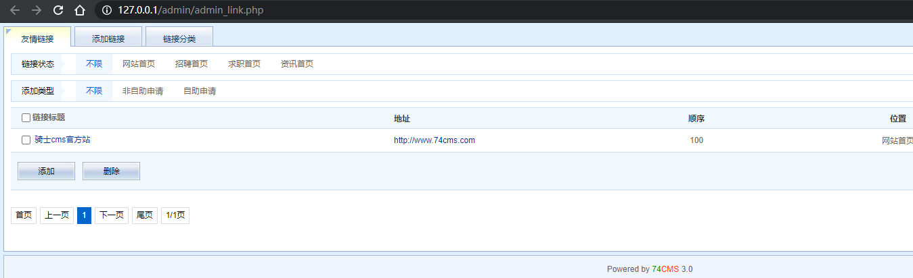
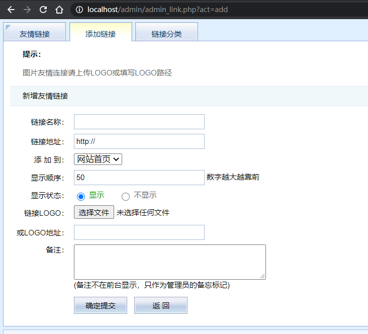
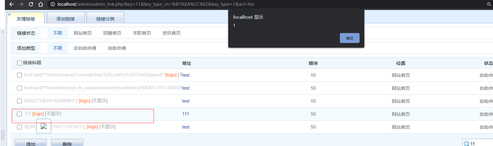
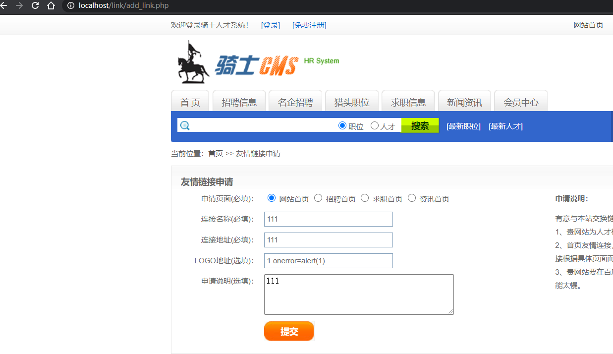

## 骑士CMS存储型XSS分析

### 审计流程

漏洞点:后台/admin/admin_link.php



源码如下:

```php
$act = !empty($_GET['act']) ? trim($_GET['act']) : 'list';
if($act == 'list')
{
	check_permissions($_SESSION['admin_purview'],"link_show"); //检查是否有管理权限
	require_once(QISHI_ROOT_PATH.'include/page.class.php');
	$oederbysql=" order BY l.show_order DESC";
	$key=isset($_GET['key'])?trim($_GET['key']):""; // 获取key的变量值
	$key_type=isset($_GET['key_type'])?intval($_GET['key_type']):""; //获取key_type的值并且转化为整型
.....
	$link = get_links($offset, $perpage,$joinsql.$wheresql.$oederbysql);
	$smarty->assign('link',$link);
	$smarty->assign('page',$page->show(3));
	$smarty->assign('upfiles_dir',$upfiles_dir);
	$smarty->assign('get_link_category',get_link_category());
	$smarty->display('link/admin_link.htm');
}
```

关键代码:
```php
$link = get_links($offset, $perpage,$joinsql.$wheresql.$oederbysql);
```

跟踪get_links函数
```php
function get_links($offset, $perpage, $get_sql= '')
{
	global $db;
	$row_arr = array();
	$limit=" LIMIT ".$offset.','.$perpage;
	$result = $db->query("SELECT l.*,c.categoryname FROM ".table('link')." AS l ".$get_sql.$limit); //查询link表并命名为$get_sql.$limit
	while($row = $db->fetch_array($result))
	{
	$row_arr[] = $row;
	}
	return $row_arr;	
}
```

这一函数是查询所有友情列表并以数组结果返回。

继续往下看

```php
$link = get_links($offset, $perpage,$joinsql.$wheresql.$oederbysql);
$smarty->assign('link',$link);
$smarty->assign('page',$page->show(3));
$smarty->assign('upfiles_dir',$upfiles_dir);
$smarty->assign('get_link_category',get_link_category());
$smarty->display('link/admin_link.htm');
```

这一段是将得到的友情列表数组传给各个模板输出显示在link/admin_link.htm



结合图片看admin_link.htm模块，发现有一段代码如下:

```php
<span style="color:#FF6600" title="" class="vtip">[logo]</span>
```



