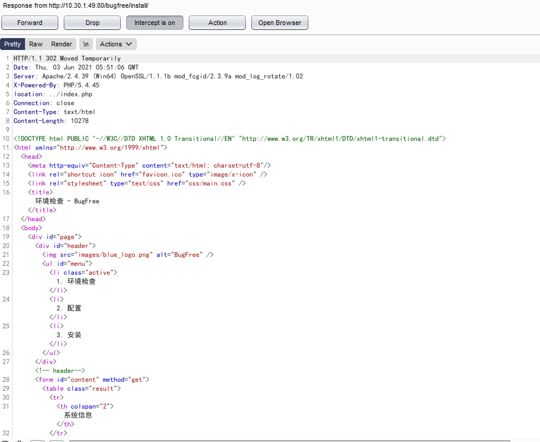
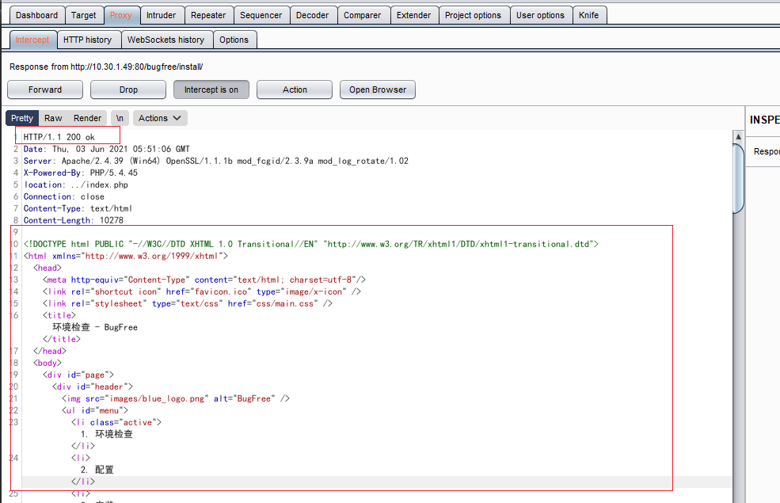
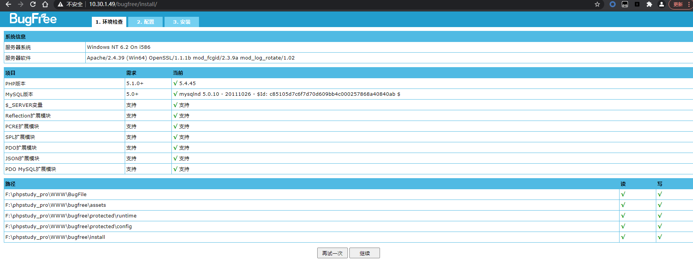

## BugFree重装漏洞案例

### 环境准备
- phpstudy
- phpstorm
- 源码地址: http://down.chinaz.com/soft/31316.htm

### 漏洞复现

- 漏洞点文件在bugfree/install/index.php,代码如下：

```php
$action = isset($_REQUEST['action']) ? $_REQUEST['action'] : CHECK;
if(is_file("install.lock") && $action != UPGRADED && $action != INSTALLED)
{
    header("location: ../index.php");
}
```

- 这一段先判断是否存在所文件(install.lock)，若存在则说明安装过了，会自动跳转到首页index.php里。但是这里有个问题，后面没有exit()或die()退出程序，后面的代码仍然会继续执行。header()函数会让程序返回浏览器一个302的状态码，浏览器受到后会重定向到首页。

- 访问/bugfree/install,burpsuite抓包如图:



- 可以看到状态头如下：
```
HTTP/1.1 302 Moved Temporarily
```

我们将其修改如下:
```
HTTP/1.1 200 ok
```





成功不再重定向到首页。

### 总结

总的来说是header()函数只能让页面302重定向到某个页面，并不能阻止后面代码继续执行，我们可以修改302状态码为200从而绕过重定向。