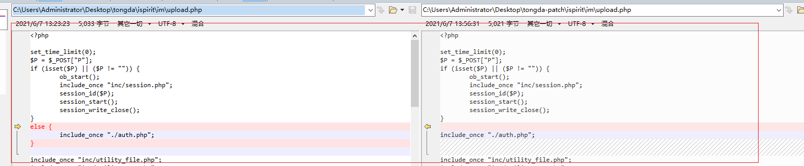
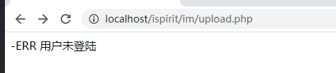
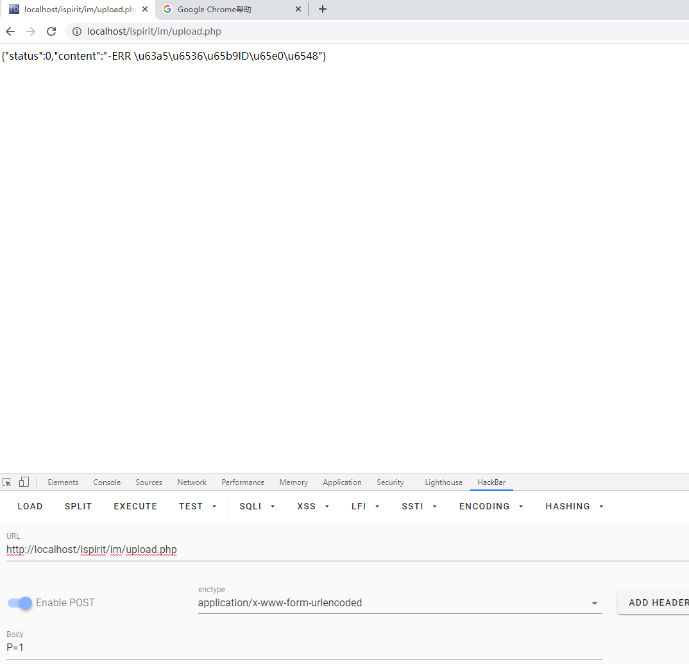

## 通达OA-代码审计

### 环境准备

- 解密代码：SeayDzend.zip
- [官方补丁](https://www.tongda2000.com/news/p673.php)
- [通达oa11.3源码](https://cdndown.tongda2000.com/oa/2019/TDOA11.3.exe)
- Beyond Compare

### 审计过程

首先用SeayDzend工具将补丁前与补丁后的webroot都解密一遍(时间有点长)，放到Beyond Compare跑(左边为打补丁前的源码，右边为打补丁后的源码)



```php
<?php

set_time_limit(0);
$P = $_POST["P"];
if (isset($P) || ($P != "")) {
	ob_start();
	include_once "inc/session.php";
	session_id($P);
	session_start();
	session_write_close();
}
else {
	include_once "./auth.php";
}

```
可知，只要判断P参数是否不为空，就能开启session，从而达到绕过认证的目的，打补丁后是删除了else{},也就是不管p为不为空都要包含auth.php认证文件。

auth.php文件代码如下：(这里会检查你的login_user_id等session,若没有返回未登录)
```php
<?php
include_once "inc/session.php";
session_start();
session_write_close();
include_once "inc/conn.php";
include_once "inc/utility.php";
ob_start();
if (!isset($_SESSION["LOGIN_USER_ID"]) || ($_SESSION["LOGIN_USER_ID"] == "") || !isset($_SESSION["LOGIN_UID"]) || ($_SESSION["LOGIN_UID"] == "")) {
	sleep(1);
	if (!isset($_SESSION["LOGIN_USER_ID"]) || ($_SESSION["LOGIN_USER_ID"] == "") || !isset($_SESSION["LOGIN_UID"]) || ($_SESSION["LOGIN_UID"] == "")) {
		echo "-ERR " . _("用户未登陆");
		exit();
	}
}
?>

```
- 未打补丁前的无P参数如图:

- 未打补丁前的有P参数如图:



接着包含了三个文件
```php
include_once "inc/utility_file.php";
include_once "inc/utility_msg.php";
include_once "mobile/inc/funcs.php";
```

```php
$TYPE = $_POST["TYPE"];
$DEST_UID = $_POST["DEST_UID"];
$dataBack = array();

if (($DEST_UID != "") && !td_verify_ids($ids)) {
	$dataBack = array("status" => 0, "content" => "-ERR " . _("接收方ID无效"));
	echo json_encode(data2utf8($dataBack));
	exit(); //这里判断$DEST_UID不为空
}
```


这里判断$DEST_UID不为空且用td_verify_ids函数，这里跟踪一下函数:

在inc/utilify.php第819行有:
```php
function td_verify_ids($ids)
{
	return !preg_match("/[^0-9,]+/", $ids);
}
```

这里对`$ids`进行正则匹配，要求为数字开头。这里我还是没看懂`$ids`这个变量从哪里来的。

思考许久，我猜是这里$DEST_UID不为空，但是我们没有对$ids赋值导致后面

```php
if (strpos($DEST_UID, ",") !== false) {
}
else {
	$DEST_UID = intval($DEST_UID);
}

if ($DEST_UID == 0) {
	if ($UPLOAD_MODE != 2) {
		$dataBack = array("status" => 0, "content" => "-ERR " . _("接收方ID无效"));
		echo json_encode(data2utf8($dataBack));
		exit();
	}
}
```

这一段判断$DEST_UID

**resource**
https://www.anquanke.com/post/id/210395