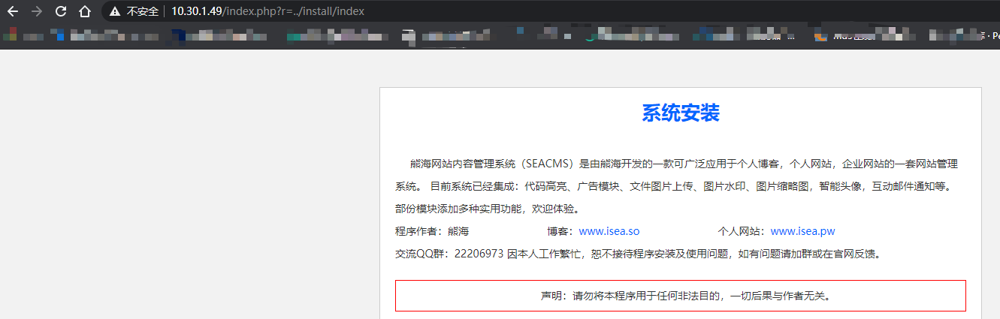
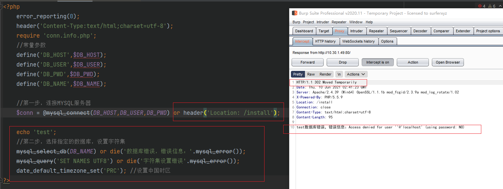
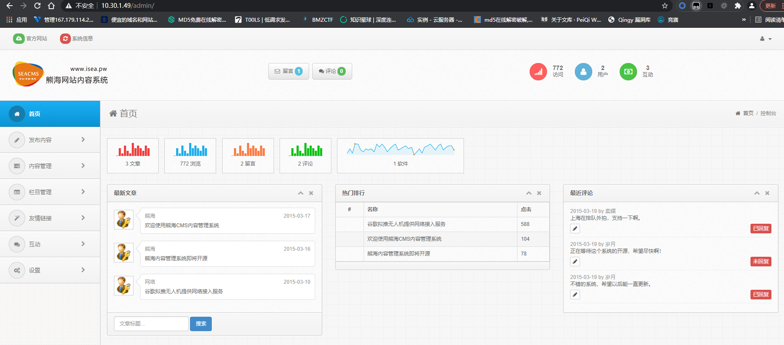
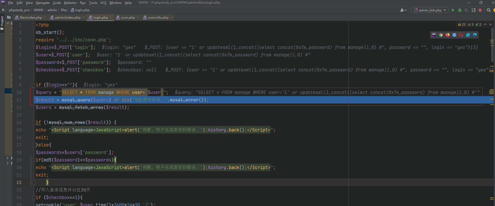
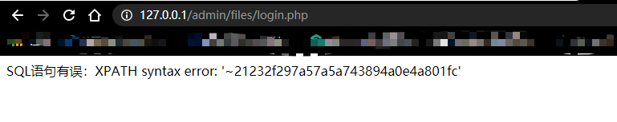
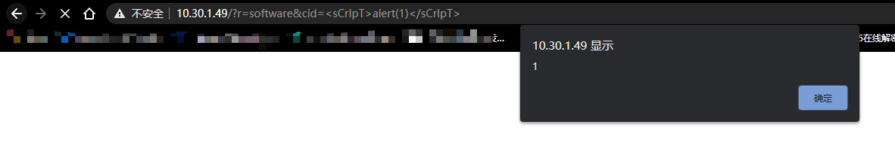
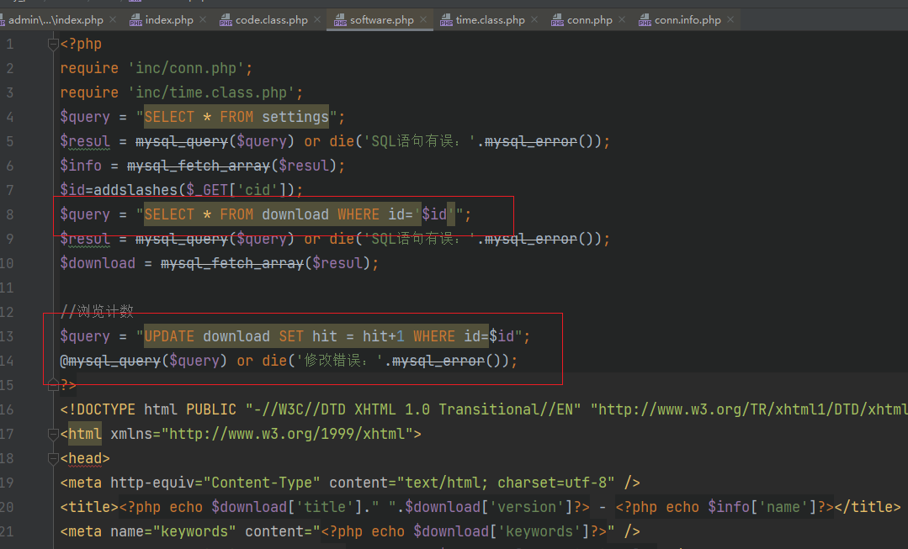
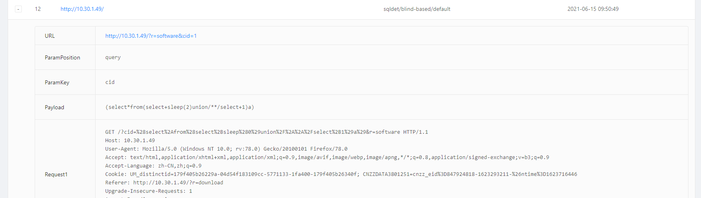

# 熊海cms xhcms v1.0代码审计

## 环境准备

[熊海cms源码下载](http://down.chinaz.com/soft/36930.htm)

phpstudy+phpstorm

---

## 审计流程

首先分析index.php
```php
<?php
//单一入口模式
error_reporting(0); //关闭错误显示
$file=addslashes($_GET['r']); //接收文件名
$action=$file==''?'index':$file; //判断为空或者等于index
include('files/'.$action.'.php'); //载入相应文件
?>
```

## 文件包含漏洞

默认跳转到files/index.php，但这里有个文件包含漏洞，未加任何过滤，只需访问
`http://10.30.1.49/index.php?r=../install/index`,即可包含install下的index.php文件



接着看files下的index.php
```php
// files/index.php
<?php 
require 'inc/301.php';
require 'inc/conn.php';
require 'inc/time.class.php';
$query = "SELECT * FROM settings";
$resul = mysql_query($query) or die('SQL语句有误：'.mysql_error());
$info = mysql_fetch_array($resul);
?>
```

开头包含了三个文件，其中301.php文件为空，conn.php文件是数据库配置，time.class.php是返回时间的函数。跟踪一下conn.php。

```php
<?php
	error_reporting(0);
	header('Content-Type:text/html;charset=utf-8');
	require 'conn.info.php'; //里面是数据库名、密码等，还未设置。
	//常量参数
	define('DB_HOST',$DB_HOST);
	define('DB_USER',$DB_USER);
	define('DB_PWD',$DB_PWD);
	define('DB_NAME',$DB_NAME);
	
	//第一步，连接MYSQL服务器
	$conn = @mysql_connect(DB_HOST,DB_USER,DB_PWD) or die(header('Location: /install'));
	
	//第二步，选择指定的数据库，设置字符集
	mysql_select_db(DB_NAME) or die('数据库错误，错误信息：'.mysql_error());
	mysql_query('SET NAMES UTF8') or die('字符集设置错误'.mysql_error());
	date_default_timezone_set('PRC'); //设置中国时区
```

这一段有判断连接数据库，若失败则返回到install目录下并且die()中止程序。我这里做了个测试，如果把die()删掉只保留header(),会出现如下:



修改http为:`HTTP/1.1 200 ok`,就会继续执行代码，在一些场景可以通过burpsuite抓包修改302重定向为200ok来执行代码。

接下来去读取install文件

```php
<?PHP
ob_start();
error_reporting(0);
header('Content-Type:text/html;charset=utf-8');
if(file_exists('InstallLock.txt'))
 {
echo "你已经成功安装熊海内容管理系统，如果需要重新安装请删除install目录下的InstallLock.txt";
exit;
 }
$save=$_POST['save'];
$user=$_POST['user'];
$password=md5($_POST['password']);
$dbhost=$_POST['dbhost'];
$dbuser=$_POST['dbuser'];
$dbpwd=$_POST['dbpwd'];
$dbname=$_POST['dbname'];
if ($save<>""){ // <>是不等于 确认正确并提交的按钮
if ($user==""){ 
echo "<script>alert('抱歉，管理用户名不能为空！');history.back()</script>";
exit;	
	}
if ($_POST['password']==""){
echo "<script>alert('抱歉，管理密码不能为空！');history.back()</script>";
exit;	
	}
if ($dbhost==""){
echo "<script>alert('抱歉，数据库地址不能为空！');history.back()</script>";
exit;	
	}
	if ($dbname==""){
echo "<script>alert('抱歉，数据库名不能为空！');history.back()</script>";
exit;	
	}
	if ($dbuser==""){
echo "<script>alert('抱歉，数据库用户名不能为空！');history.back()</script>";
exit;	
	}
	if ($dbpwd==""){
echo "<script>alert('抱歉，数据库密码不能为空！');history.back()</script>";
exit;	
	}
include '../inc/db.class.php';
$db = new DBManage ( $dbhost, $dbuser, $dbpwd, $dbname, 'utf8' );
$db->restore ('seacms.sql'); //这里调用DBManage类来执行restore导入seacms.sql文件
$content = "<?php
\$DB_HOST='".$dbhost."';
\$DB_USER='".$dbuser."';
\$DB_PWD='".$dbpwd."';
\$DB_NAME='".$dbname."';
?>
";
$of = fopen('../inc/conn.info.php','w');
if($of){
 fwrite($of,$content);
}
echo "MySQL数据库连接配置成功!<br /><br />";


$conn = @mysql_connect($dbhost,$dbuser,$dbpwd) or die('数据库连接失败，错误信息：'.mysql_error());
mysql_select_db($dbname) or die('数据库错误，错误信息：'.mysql_error());
mysql_query('SET NAMES UTF8') or die('字符集设置错误'.mysql_error());

$query = "UPDATE manage SET user='$user',password='$password',name='$user'";
@mysql_query($query) or die('修改错误：'.mysql_error());
echo "管理信息已经成功写入!<br /><br />";


$content = "熊海内容管理系统 V1.0\r\n\r\n安装时间：".date('Y-m-d H:i:s');
$of = fopen('InstallLock.txt','w');
if($of){
 fwrite($of,$content);
}
fclose($of);
echo "为防止重复安装，安装锁已经生成!<br /><br />";
echo "<font color='#006600'>恭喜,熊海网站管理系统已经成功安装！</font>";
exit;
ob_end_flush();
}
?>
```
ob_start()与ob_end_flush()函数配套,这里作用是打开缓冲区先将PHP代码的数据块和echo()输出都会进入缓冲区而不会立刻输出。

在install配置信息，但在数据库名称报错了，尝试xdebug了一下是在`$db = new DBManage ( $dbhost, $dbuser, $dbpwd, $dbname, 'utf8' );`一段实例化失败，数据库未连接成功，这里需要我们手动创建数据库名。

接着去访问install观察是否有重装漏洞

```php
if(file_exists('InstallLock.txt'))
 {
echo "你已经成功安装熊海内容管理系统，如果需要重新安装请删除install目录下的InstallLock.txt";
exit;
 }
```

这里用锁文件且exit退出，看样子是不会存在重装漏洞了。且seay系统报的两个install下的文件读取以及SQL代码都是在锁文件代码之后，无法绕过。

seay扫了下说是有一处文件包含漏洞在admin/index.php

```php
<?php
//单一入口模式
error_reporting(0); //关闭错误显示
$file=addslashes($_GET['r']); //接收文件名
$action=$file==''?'index':$file; //判断为空或者等于index
include('files/'.$action.'.php'); //载入相应文件
?>
```

## 文件包含漏洞

代码是跟入口文件首页index.php是一样的，同样访问`http://10.30.1.49/admin/index.php?r=../../install/index`可以进入到重装页面，因为file_exists是检测当前目录下的installLocak文件锁，而当前目录是admin/,所以绕过验证。

接着是默认包含admin/files/index.php

```php
<?php
require '../inc/checklogin.php';
require '../inc/conn.php';
$indexopen='class="open"';
?>
```
首先包含checklogin和conn两个php文件，首先读取checklogin.php文件，如下:
```php
<?php
$user=$_COOKIE['user'];
if ($user==""){
header("Location: ?r=login");
exit;	
}
?>
```

## 垂直越权漏洞

这里说$_COOKIE为空的话则重定向到登陆页面login，尝试抓包修改Cookie:user=1成功绕过登录认证进入后台。



这里分析一下?r=login跳转到的login.php源码吧

```php
// admin/files/login.php
<?php 
ob_start();
require '../inc/conn.php';
$login=$_POST['login'];
$user=$_POST['user'];
$password=$_POST['password'];
$checkbox=$_POST['checkbox'];

if ($login<>""){
$query = "SELECT * FROM manage WHERE user='$user'";
$result = mysql_query($query) or die('SQL语句有误：'.mysql_error());
$users = mysql_fetch_array($result);

if (!mysql_num_rows($result)) {  
echo "<Script language=JavaScript>alert('抱歉，用户名或者密码错误。');history.back();</Script>";
exit;
}else{
$passwords=$users['password'];
if(md5($password)<>$passwords){
echo "<Script language=JavaScript>alert('抱歉，用户名或者密码错误。');history.back();</Script>";
exit;	
	}
//写入登录信息并记住30天
if ($checkbox==1){
setcookie('user',$user,time()+3600*24*30,'/');
}else{
setcookie('user',$user,0,'/');
}
echo "<script>this.location='?r=index'</script>";
exit;
}
exit;
ob_end_flush();
}
?>
```
## 登录框SQL注入 

这里有个bug，把`require '../inc/conn.php';`改为`require '../../inc/conn.php';`才能正常运行，估计是程序员没写好，在第十行有一处SQL语句如下：
```php
$query = "SELECT * FROM manage WHERE user='$user'";
```

这里可以用报错注入来爆出密码，也可用延时注入(可以结合xray黑盒测试出)
```
1' or updatexml(1,concat((select concat(0x7e,password) from manage)),0) #
1' or updatexml(1,concat((select concat(password,0x7e) from manage)),0) #
```

用phpstorm xdebug跑一下观看流程原理。





可以看出在第11行将报错注入的语句带到数据库查询触发语句。由于md5返回的值只有27位，需要拼接两次语句。


## XSS漏洞 && SQL注入漏洞

接着结合xray黑盒测试在前台点一点，发现在菜单下载一栏爆出xss漏洞。



xdebug跟踪一下代码在software.php




在第143行有html输出的代码如下:
```html
<form  name="form" method="post" action="/?r=submit&type=download&cid=<?php echo $id?>">
<input name="cid" type="hidden" value="<?php echo $id?>"/>
```

很明显，嵌入从而触发了XSS漏洞。是个存储型XSS。同时该$id也存在SQL注入。在第8行代码如下：
```php
$query = "SELECT * FROM download WHERE id='$id'";
$resul = mysql_query($query) or die('SQL语句有误：'.mysql_error());
$download = mysql_fetch_array($resul);
```



跟前面的SQL原理是一样的，具体操作不再阐述。

## 总结感悟

- 对PHPStorm Xdebug熟练度+1
- 结合xray黑盒审计+白盒审计
- 通读xhcms增加理解