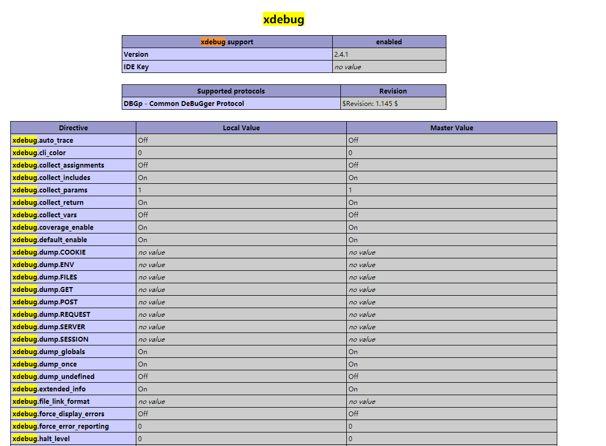
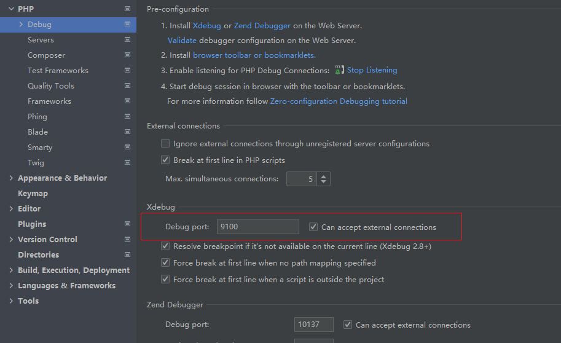
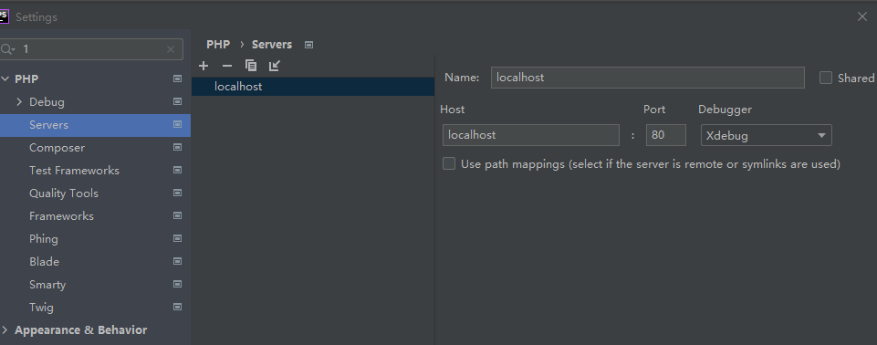
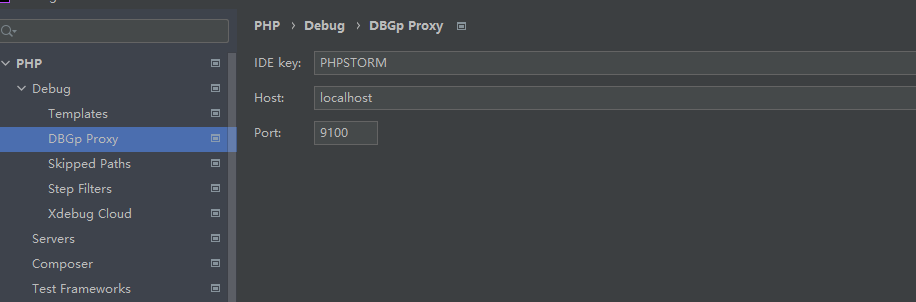
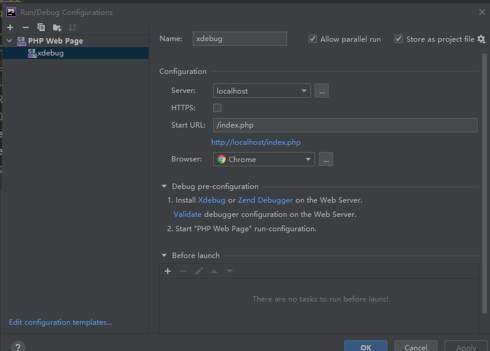
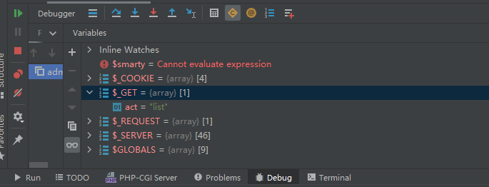

## PHPStorm-XDbug


## 环境准备
phpstudy(`小皮系统xp.cn`):网站-管理-PHP扩展-php_xdebug

php.ini配置如下:
```
[Xdebug]
zend_extension=F:/phpstudy_pro/Extensions/php/php5.5.9nts/ext/php_xdebug.dll
xdebug.collect_params=1
xdebug.collect_return=1
xdebug.auto_trace=On
xdebug.trace_output_dir=F:/phpstudy_pro/Extensions/php_log/php5.5.9nts.xdebug.trace
xdebug.profiler_enable=On
xdebug.profiler_output_dir=F:/phpstudy_pro/Extensions/php_log/php5.5.9nts.xdebug.profiler
xdebug.remote_enable=On
xdebug.remote_host=localhost
xdebug.remote_port=9100
xdebug.remote_handler=dbgp
xdebug.idekey = PHPSTORM

```

重启Apache服务->验证:phpinfo() 或者php.exe -m



- File->PHP->Debug 




- File->PHP->Servers



- File->PHP->Debug->DBGp Proxy



- Run->Edit Configurations




## 使用方法

Debugger 查看所有变量
F8 step over 
F7 step into 步进 进入函数内部执行
Alt+shift+F7 force step into
step out shift+f8 跳过区块 跳到下一个断点
alt+F9 run to cursor 执行到光标处

断点调试时，PHP 脚本执行超时后 Apache 自动断开连接，然后返回一个 500 错误

