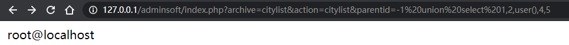
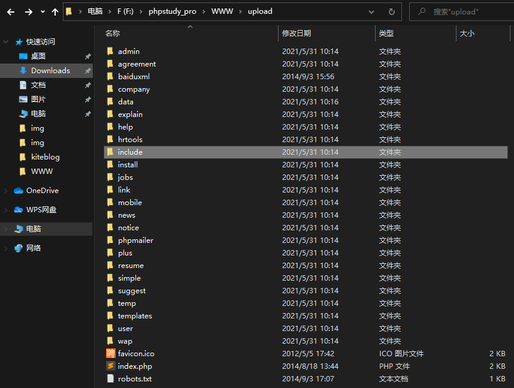
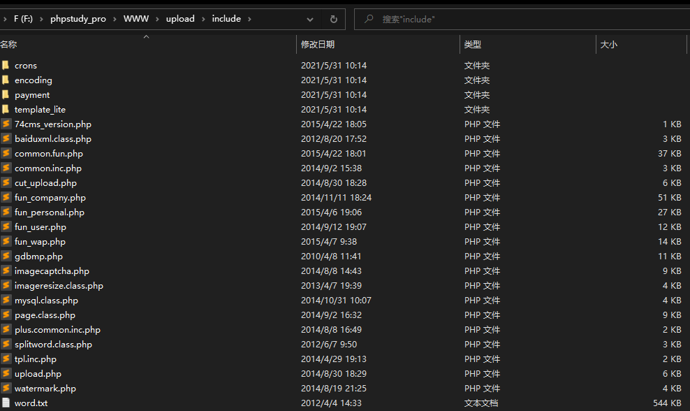

# 代码审计企业级Web代码安全架构
> 这里记录学习《代码审计企业级Web代码安全架构》 书本笔记

- [通用代码审计思路](#通用代码审计思路)
	- [敏感函数回溯参数过程](#敏感函数回溯参数过程)
		- [espcms-注入挖掘案例](#espcms-注入挖掘案例)
	- [通读全文代码](#通读全文代码)
		- [骑士cms通读案例](#骑士cms通读案例)
# 通用代码审计思路

**常见的代码审计思路有以下四种**

- 根据敏感关键字回溯参数传递过程。
- 查找可控变量，正向追踪变量传递过程。
- 寻找敏感功能点，通读功能点代码。
- 直接通读全文代码

## 敏感函数回溯参数过程
## espcms-注入挖掘案例


### 环境准备
- PHPStudy
- espcms 源码
    - 下载地址：http://down.chinaz.com/soft/27695.htm
- Seay源代码审计工具

**环境搭建**

将epscms的upload里面所有源码放到网站www目录下,访问地址http://127.0.0.1/install，一路继续即可，注意数据库用户和密码改为自己的


### 审计过程

首先用seay源代码审计系统跑一下自动审计，如图：


分析其中的citylist.php文件(/adminsoft/control/citylist.php)
```php
$sql = "select * from $db_table where parentid=$parentid";
```
该SQL语句没有引号保护，可能存在数字型注入。 

定位$parentid变量

```php
$parentid = $this->fun->accept('parentid', 'R');
$parentid = empty($parentid) ? 1 : $parentid;

$sql = "select * from $db_table where parentid=$parentid";
$rs = $this->db->query($sql);
```

$parentid变量在oncitylist()函数中，是accept('parentid', 'R')函数的返回值，右键定位accept函数。

```php
	function accept($k, $var='R', $htmlcode=true, $rehtml=false) {
		switch ($var) {
			case 'G':
				$var = &$_GET;
				break;
			case 'P':
				$var = &$_POST;
				break;
			case 'C':
				$var = &$_COOKIE;
				break;
			case 'R':
				$var = &$_GET;  //让parentid变成变量
				if (empty($var[$k])) { //$_GET['parentid']
					$var = &$_POST;
				}
				break;
		}
		$putvalue = isset($var[$k]) ? $this->daddslashes($var[$k], 0) : NULL;
		return $htmlcode ? ($rehtml ? $this->preg_htmldecode($putvalue) : $this->htmldecode($putvalue)) : $putvalue;
	}

```
由此可知，这是一个获取GET、POST、COOKIE参数值的函数，我们传入的变量是parentid和R，则代表在GET与POST都可以获取parentid参数，最后经过了一个daddslashes函数，本质上是包装的addslashes()函数，对单双引号、反斜杆与空进行过滤。但前面的SQL语句是没有引号包含，存在数字型注入。

在citylistphp文件可用看到SQL语句在oncitylist()函数中，同时该函数又在important类中，右键选中该类名进行全局搜索。可以发现在index.php有实例化的类。

```php
$point = indexget('point', 'R'); //获取过滤后的point
$point = empty($point) ? 'admin' : $point;
$archive = indexget('archive', 'R'); //获取过滤后的$archive
$archive = empty($archive) ? 'adminuser' : $archive;
$action = indexget('action', 'R');//获取过滤后的action
$action = empty($action) ? 'login' : $action;
$soft_MOD = array('admin', 'public', 'product', 'forum', 'filemanage', 'basebook', 'member', 'order', 'other', 'news', 'inc', 'cache', 'bann', 'logs', 'template');
if (in_array($point, $soft_MOD)) {
	include admin_ROOT . adminfile . "/control/$archive.php";
	$control = new important();
	$action = 'on' . $action;
	if (method_exists($control, $action)) {
		$control->$action();
	} else {
		exit('错误：系统方法错误！');
	}
```

indexget函数跟accept函数功能是一样的。

### 漏洞触发

开头SQL语句位于`oncitylist()`函数，该函数时`important`类的成员函数，其所在文件为`/adminsoft/control/citylist.php`,因此上面文件包含我们先要包含这个文件，即`$archive=citylist`。

$archive 变量的取值范围是 /adminsoft/control 下的文件名，默认为 adminuser。
$action 变量的值，在其前加上 on 就是上述文件里的函数名，默认为 login。


payload如下：
```payload
http://127.0.0.1/adminsoft/index.php?archive=citylist&action=citylist&parentid=-1%20union%20select%201,2,user(),4,5
```



黑盒测试发现得先需要登录后台才能利用，实战中并没有多大利用，就当代码审计学习了。
### Resource
https://6xian.github.io/2018/04/22/codes-audit-basic-espcms-numeric-sqli/

https://www.codenong.com/cs107094320/


## 通读全文代码

## 骑士cms通读审计案例

- [骑士cms3.5.1源码下载地址](https://www.74cms.com/download/lists/module_name/Home/type/setup/cname/%E9%AA%91%E5%A3%AB%E4%BA%BA%E6%89%8D%E7%B3%BB%E7%BB%9F%E5%9F%BA%E7%A1%80%E7%89%88%28%E5%AE%89%E8%A3%85%E5%8C%85%29.html)

- 首先查看有哪些文件和文件夹，寻找名称有没有带api、admin、manage、include一类关键字的文件和文件夹，通常这些文件比较重要，可以看到只有一个index.php的php文件，看到有个include文件夹，一般比较核心的文件都会放在这个文件夹中。




- common.fun.php是本程序的核心文件(函数集文件)，基础函数基本在这个文件中实现
- 点击该文件，有一大堆过滤函数，首先是一个SQL过滤函数。

```php
function addslashes_deep($value)
{
    if (empty($value))
    {
        return $value;
    }
    else
    {
		if (!get_magic_quotes_gpc())
		{
		$value=is_array($value) ? array_map('addslashes_deep', $value) : mystrip_tags(addslashes($value));
		}
		else
		{
		$value=is_array($value) ? array_map('addslashes_deep', $value) : mystrip_tags($value);
		}
		return $value;
    }
}
```

- array_map() 函数将用户自定义函数作用到数组中的每个值上，并返回用户自定义函数作用后的带有新的值的数组。
```php
<?php
function myfunction($num)
{
   return($num*$num);
}

$a=array(1,2,3,4,5);
print_r(array_map("myfunction",$a));
?>
//输出：Array ( [0] => 1 [1] => 4 [2] => 9 [3] => 16 [4] => 25 )
```

这是一段SQL注入过滤函数，用addslashes()函数过滤单引号、双引号、斜杆、NULL，再用array_map对如果是数组的对数组里每个值都经历一次addslashes函数过滤。但如果是数字型注入以及宽字节注入还是能绕过的。

继续看下一段XSS过滤函数。

```php
function mystrip_tags($string)
{
	$string = new_html_special_chars($string);
	$string = remove_xss($string);
	return $string;
}
```

该函数mystrip_tags调用了两个函数分别为new_html_special_chars()与remove_xss()来过滤xss，就在该函数下方。

```php
function new_html_special_chars($string) {
	$string = str_replace(array('&amp;', '&quot;', '&lt;', '&gt;'), array('&', '"', '<', '>'), $string);
	$string = strip_tags($string);
	return $string;
}
function remove_xss($string) { 
    $string = preg_replace('/[\x00-\x08\x0B\x0C\x0E-\x1F\x7F]+/S', '', $string);
// 非可打印字符被替换为空
    $parm1 = Array('javascript', 'union','vbscript', 'expression', 'applet', 'xml', 'blink', 'link', 'script', 'embed', 'object', 'iframe', 'frame', 'frameset', 'ilayer', 'layer', 'bgsound', 'title', 'base');

    $parm2 = Array('onabort', 'onactivate', 'onafterprint', 'onafterupdate', 'onbeforeactivate', 'onbeforecopy', 'onbeforecut', 'onbeforedeactivate', 'onbeforeeditfocus', 'onbeforepaste', 'onbeforeprint', 'onbeforeunload', 'onbeforeupdate', 'onblur', 'onbounce', 'oncellchange', 'onchange', 'onclick', 'oncontextmenu', 'oncontrolselect', 'oncopy', 'oncut', 'ondataavailable', 'ondatasetchanged', 'ondatasetcomplete', 'ondblclick', 'ondeactivate', 'ondrag', 'ondragend', 'ondragenter', 'ondragleave', 'ondragover', 'ondragstart', 'ondrop', 'onerror', 'onerrorupdate', 'onfilterchange', 'onfinish', 'onfocus', 'onfocusin', 'onfocusout', 'onhelp', 'onkeydown', 'onkeypress', 'onkeyup', 'onlayoutcomplete', 'onload', 'onlosecapture', 'onmousedown', 'onmouseenter', 'onmouseleave', 'onmousemove', 'onmouseout', 'onmouseover', 'onmouseup', 'onmousewheel', 'onmove', 'onmoveend', 'onmovestart', 'onpaste', 'onpropertychange', 'onreadystatechange', 'onreset', 'onresize', 'onresizeend', 'onresizestart', 'onrowenter', 'onrowexit', 'onrowsdelete', 'onrowsinserted', 'onscroll', 'onselect', 'onselectionchange', 'onselectstart', 'onstart', 'onstop', 'onsubmit', 'onunload','style','href','action','location','background','src','poster');
	
	$parm3 = Array('alert','sleep','load_file','confirm','prompt','benchmark','select','update','insert','delete','alter','drop','truncate','script','eval','outfile','dumpfile');

    $parm = array_merge($parm1, $parm2, $parm3); 

	for ($i = 0; $i < sizeof($parm); $i++) {  //sizeof计算有数组里有多少个
		$pattern = '/'; 
		for ($j = 0; $j < strlen($parm[$i]); $j++) { 
			if ($j > 0) { 
				$pattern .= '('; 
				$pattern .= '(&#[x|X]0([9][a][b]);?)?'; 
				$pattern .= '|(&#0([9][10][13]);?)?'; 
				$pattern .= ')?'; 
			}
			$pattern .= $parm[$i][$j];  // '/((&#[x|X]0([9][a][b]);?)?|(&#0([9][10][13]);?)?)?o/i'
		}
		$pattern .= '/i';
		$string = preg_replace($pattern, '****', $string); 
	}
	return $string; 
}
```

-  new_html_special_chars()函数是对&符号、双引号、尖括号进行了html实体编码，并用strip_tags()函数进行了二次过滤。
- array_merge 将多个数组合并成一个数组，renive_xss()函数是对一些标签关键字、敏感函数关键字进行了替换。

接着下面还有一个获取IP地址的函数getip(),是可以伪造IP地址的。

```php
function getip()
{
	if (getenv('HTTP_CLIENT_IP') and strcasecmp(getenv('HTTP_CLIENT_IP'),'unknown')) {
		$onlineip=getenv('HTTP_CLIENT_IP');
	}elseif (getenv('HTTP_X_FORWARDED_FOR') and strcasecmp(getenv('HTTP_X_FORWARDED_FOR'),'unknown')) {
		$onlineip=getenv('HTTP_X_FORWARDED_FOR');
	}elseif (getenv('REMOTE_ADDR') and strcasecmp(getenv('REMOTE_ADDR'),'unknown')) {
		$onlineip=getenv('REMOTE_ADDR');
	}elseif (isset($_SERVER['REMOTE_ADDR']) and $_SERVER['REMOTE_ADDR'] and strcasecmp($_SERVER['REMOTE_ADDR'],'unknown')) {
		$onlineip=$_SERVER['REMOTE_ADDR'];
	}
	preg_match("/\d{1,3}\.\d{1,3}\.\d{1,3}\.\d{1,3}/",$onlineip,$match);
	return $onlineip = $match[0] ? $match[0] : 'unknown';
}
```