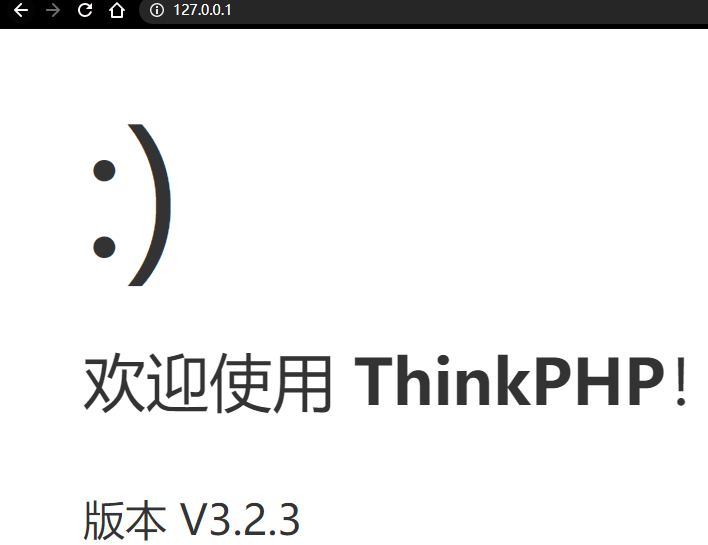
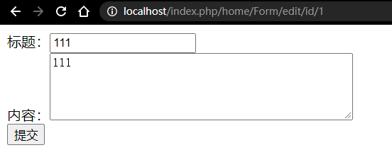

# thinkphp3.2.3快速入门

- [环境搭建](#环境搭建)
- [基础](#基础)
    - [目录结构](#目录结构)
    - [入口文件](#入口文件)
    - [调试模式](#调试模式)
    - [配置](#配置)
    - [控制器](#控制器)
    - [URL请求](#URL请求)
    - [视图](#视图)
    - [读取数据](#读取数据)
    - [总结](#总结)
- [CURD](#CURD)
    - [创建数据](#创建数据)
    - [模型](#模型)
    - [读取数据](#读取数据)
    - [更新数据](#更新数据)
    - [删除数据](#删除数据)
    - [总结](#总结)
- [查询语言](#查询语言)
    - [查询方式](#查询方式)
    - [总结](#总结)
- [连贯操作](#连贯操作)
    - [WHERE](#WHERE)
    - [TABLE](#TABLE)
    - [DATA](#DATA)
    - [FIELD](#FIELD)
    - [ORDER](#ORDER)
    - [LIMIT](#LIMIT)
    - [PAGE](#PAGE)
    - [GROUP](#GROUP)
    - [HAVING](#HAVING)
    - [JOIN](#JOIN)
    - [UNION](#UNION)
    - [DISTINCT](#DISTINCT)
    - [LOCK](#LOCK)
    - [VALIDATE](#VALIDATE)
    - [AUTO](#AUTO)
    - [FILTER](#FILTER)
    - [总结](#总结)
- [变量](#变量)
    - [获取变量](#获取变量)
    - [变量过滤](#变量过滤)
    - [变量修饰符](#变量修饰符)
- [路由](#路由)
    - [路由定义](#路由定义)
    - [路由表达式](#路由表达式)
    - [路由地址和参数](#路由地址和参数)
    - [闭包支持](#闭包支持)
    - [静态路由](#静态路由)
    - [总结](#总结)
- [视图](#视图)
    - [模板定义](#模板定义)
    - [模板渲染](#模板渲染)
    - [渲染内容](#渲染内容)
    - [模板赋值](#模板赋值)
    - [总结](#总结)


---

预计学完时间：七个工作日 7.15-7.22

---

## 环境搭建

- [thinkphp3.2.3完整版](http://www.thinkphp.cn/down/framework/p/2.html)
- [thinphp3.2.3完全开发手册](https://www.kancloud.cn/manual/thinkphp/1681)
- [thinkphp3.2.3快速入门](https://www.kancloud.cn/thinkphp/thinkphp_quickstart/2138)

## 基础

### 目录结构

```
www  WEB部署目录（或者子目录）
├─index.php       入口文件
├─README.md       README文件
├─composer.json   Composer定义文件
├─Application     应用目录
├─Public          资源文件目录
└─ThinkPHP        框架核心目录
```

```
├─ThinkPHP 框架系统目录（可以部署在非web目录下面）
│  ├─Common       核心公共函数目录
│  ├─Conf         核心配置目录 
│  ├─Lang         核心语言包目录
│  ├─Library      框架类库目录
│  │  ├─Think     核心Think类库包目录
│  │  ├─Behavior  行为类库目录
│  │  ├─Org       Org类库包目录
│  │  ├─Vendor    第三方类库目录
│  │  ├─ ...      更多类库目录
│  ├─Mode         框架应用模式目录
│  ├─Tpl          系统模板目录
│  ├─LICENSE.txt  框架授权协议文件
│  ├─logo.png     框架LOGO文件
│  ├─README.txt   框架README文件
│  └─index.php    框架入口文件
```

### 入口文件

```php
define('APP_PATH','./Application/');
require './ThinkPHP/ThinkPHP.php';
```

这段代码的作用就是定义应用目录和加载ThinkPHP框架的入口文件，这是所有基于ThinkPHP开发应用的第一步。

然后，在浏览器中访问运行后我们会看到欢迎页面：



当你看到这个欢迎页面的时候，系统已经在Application目录下面自动生成了公共模块Common、默认模块Home和Runtime运行时目录，如下所示：

```
Application
├─Common         应用公共模块
│  ├─Common      应用公共函数目录
│  └─Conf        应用公共配置文件目录
├─Home           默认生成的Home模块
│  ├─Conf        模块配置文件目录
│  ├─Common      模块函数公共目录
│  ├─Controller  模块控制器目录
│  ├─Model       模块模型目录
│  └─View        模块视图文件目录
├─Runtime        运行时目录
│  ├─Cache       模版缓存目录
│  ├─Data        数据目录
│  ├─Logs        日志目录
│  └─Temp        缓存目录模块设计
```

典型的一个模块目录结构如下：采用多层的MVC机制
```
Application      默认应用目录（可以设置）
├─Common         公共模块（不能直接访问）
├─Home           前台模块
├─Admin          后台模块
├─...            其他更多模块
├─Runtime        默认运行时目录（可以设置）每个模块是相对独立的，其目录结构如下：
├─Module         模块目录
│  ├─Conf        配置文件目录
│  ├─Common      公共函数目录
│  ├─Controller  控制器目录
│  ├─Model       模型目录
│  ├─Logic       逻辑目录（可选）
│  ├─Service     服务目录（可选）
│  ... 更多分层目录可选
│  └─View        视图目录
```

入口文件添加如下内容可自动生成新的模块Admin，若重新生成需要删掉Admin模块。

```php
define('APP_PATH','./Application/');
// 绑定入口文件到Admin模块访问
define('BIND_MODULE','Admin');
require './ThinkPHP/ThinkPHP.php';
```

更改应用目录、运行时目录和框架的位置

```php
// 定义应用目录
define('APP_PATH','./Apps/');
// 定义运行时目录
define('RUNTIME_PATH','./Runtime/');
// 更名框架目录名称，并载入框架入口文件
require './Think/ThinkPHP.php';
```

最终的应用目录结构如下:
```
www  WEB部署目录（或者子目录）
├─index.php       应用入口文件
├─Apps            应用目录
├─Public          资源文件目录
├─Runtime         运行时目录
└─Think           框架目录
```

### 调试模式

```php
define('APP_DEBUG', true); // 开启调试模式
```

### 配置

每个应用模块都有独立的配置文件（位于模块目录的Conf/config.php），配置文件的定义格式支持PHP/JSON/YAML/INI/XML等方式，默认采用PHP数组定义，例如：

```php
// 配置文件
return array(
    '配置参数' => '配置值',
    // 更多配置参数
    //...
);
```

如果你需要为各个模块定义公共的配置文件，可以在公共模块中定义（通常位于 Common/Conf/config.php），定义格式是一样。

一旦有需要，我们就可以在配置文件中添加相关配置项目。

如果有需要，我们还可以为项目定义其他类型的配置文件，如果要使用其他格式的配置文件，可以在入口文件中定义CONF_EXT常量即可，例如：

```php
define('CONF_EXT','.ini');
```

这样，模块的配置文件就变成了 Conf/config.ini。


### 控制器

命名规范:`控制器名+Controller.class.php （模块名采用驼峰法并且首字母大写）`

系统的默认控制器是Index，对应的控制器就是模块目录下面的Controller/IndexController.class.php，类名和文件名一致.

默认操作是index，也就是控制器的一个public方法。

```php
<?php
namespace Home\Controller;
use Think\Controller;
class IndexController extends Controller {
    public function index(){
        echo 'hello,thinkphp!';
    }
}
// hello,thinkphp!
```

### URL请求

ThinkPHP采用单一入口模式访问应用，对应用的所有请求都定向到应用的入口文件，系统会从URL参数中解析当前请求的模块、控制器和操作，下面是一个标准的URL访问格式：

`http://serverName/index.php/模块/控制器/操作`

直接访问入口文件的话，由于URL中没有模块、控制器和操作，因此系统会访问默认模块（Home）下面的默认控制器（Index）的默认操作（index），因此下面的访问是等效的：

```
http://serverName/index.php
http://serverName/index.php/Home/Index/index
```

这种URL模式就是系统默认的PATHINFO模式，不同的URL模式获取模块和操作的方法不同，ThinkPHP支持的URL模式有四种：`普通模式`、`PATHINFO`、`REWRITE`和`兼容模式`。

- 普通模式

普通模式也就是使用传统的GET传参方式来指定当前访问的模块、控制器和操作，例如：

`http://localhost/?m=home&c=index&a=hello&name=thinkphp`

m参数表示模块，c表示控制器，a表示操作（当然，这些参数名是可以配置的），后面的表示其他GET参数。
默认值可以不传，因此下面的URL访问是和上面的等效：

`http://localhost/?a=hello&name=thinkphp`

- PATHINFO模式-PATH-INFO

PATHINFO模式是系统的默认URL模式，提供了最好的SEO支持，系统内部已经做了环境的兼容处理，所以能够支持大多数的主机环境。
对应上面的URL模式，PATHINFO模式下面的URL访问地址是：

`http://localhost/index.php/home/index/hello/name/thinkphp/`

PATHINFO地址的前三个参数分别表示模块/控制器/操作。
PATHINFO模式下面，也可以用普通模式的参数方式传入参数，例如：

`http://localhost/index.php/home/index/hello?name=thinkphp`

PATHINFO模式下面，URL参数分隔符是可定制的，例如，通过下面的配置：

`'URL_PATHINFO_DEPR'=>'-',// 更改PATHINFO参数分隔符`

我们可以支持下面的URL访问：

`http://localhost/index.php/home-index-hello-name-thinkphp`

- REWRITE模式

REWRITE模式是在PATHINFO模式的基础上添加了重写规则的支持，可以去掉URL地址里面的入口文件`index.php`，但是需要额外配置WEB服务器的重写规则。

如果是Apache则需要在入口文件的同级添加.htaccess文件，内容如下：

```
<IfModule mod_rewrite.c>
RewriteEngine on
RewriteCond %{REQUEST_FILENAME} !-d
RewriteCond %{REQUEST_FILENAME} !-f
RewriteRule ^(.*)$ index.php/$1 [QSA,PT,L]
</IfModule>
```

`http://localhost/home/index/hello/name/thinkphp/`

- 兼容模式

兼容模式是用于不支持PATHINFO的特殊环境，URL地址是：

`http://localhost/?s=/home/index/hello/name/thinkphp`

### 视图

ThinkPHP内置了一个编译型模板引擎，也支持原生的PHP模板，并且还提供了包括Smarty在内的模板引擎驱动。和Smarty不同，ThinkPHP在渲染模板的时候如果不指定模板，则会采用系统默认的定位规则，其定义规范默认是模块目录下面的 View/控制器名/操作名.html，所以，Index模块的hello操作的默认模板文件位于Home模块目录下面的View/Index/hello.html，我们添加模板内容如下：

```html
<html>
<head>
<title>hello {$name}</title>
</head>
<body>
    hello, {$name}!
</body>
</html>
```
要输出视图，必须在控制器方法中进行模板渲染输出操作，例如：

```php
<?php
namespace Home\Controller;
use Think\Controller;
class IndexController extends Controller {
    public function hello($name='thinkphp'){
        $this->assign('name',$name);
        $this->display();
    }
}
```

### 读取数据

在开始之前，我们首先在数据库thinkphp中创建一个think_data数据表（以mysql数据库为例）：

```sql
CREATE TABLE IF NOT EXISTS `think_data`(
`id`int(8)unsigned NOT NULL AUTO_INCREMENT,
`data` varchar(255) NOT NULL,
  PRIMARY KEY (`id`)
) ENGINE=MyISAM  DEFAULT CHARSET=utf8 ;
INSERT INTO `think_data`(`id`,`data`) VALUES
(1,'thinkphp'),
(2,'php'),
(3,'framework');
```


如果我们需要读取数据库中的数据，就需要在模块配置文件中添加数据库连接信息如下：

/ThinkPHP/Conf/convention.php
```php
// 添加数据库配置信息
'DB_TYPE'=>'mysql',// 数据库类型
'DB_HOST'=>'127.0.0.1',// 服务器地址
'DB_NAME'=>'thinkphp',// 数据库名
'DB_USER'=>'root',// 用户名
'DB_PWD'=>'',// 密码
'DB_PORT'=>3306,// 端口
'DB_PREFIX'=>'think_',// 数据库表前缀
'DB_CHARSET'=>'utf8',// 数据库字符集
```
接下来，我们修改下控制器方法，添加读取数据的代码：

```php
namespace Home\Controller;
use Think\Controller;
class IndexController extends Controller{
    public function index(){
        $Data     = M('Data');// 实例化Data数据模型
        $result     = $Data->find(1);
        $this->assign('result',$result);
        $this->display();
    }
}
```

`$this-assign` 打印出数组 第一个参数是在模板取值的时候所使用的变量名, 第二个参数是要传递的值。
`$this-display` 把打出来的数据放到对应的模板上


这里用到了M函数，是ThinkPHP内置的实例化模型的方法，而且用M方法实例化模型不需要创建对应的模型类，你可以理解为M方法是直接在操作底层的Model类，而Model类具备基本的CURD操作方法。

M('Data') 实例化后，就可以对think_data数据表（think_ 是我们在项目配置文件中定义的数据表前缀）进行操作（包括CURD）了，M函数的用法还有很多，我们以后会深入了解。

定义好控制器后，我们修改模板文件，添加数据输出标签如下：

/Application/Home/View/index/index.html
```html
<html>
<head>
<title></title>
</head>
<body>
{$result.id}--{$result.data}
</body>
</html>
```

模板标签的用法和Smarty类似，就是用于输出数据的字段，这里就表示输出think_data表的id和data字段的值。

我们访问会输出：

```
1--thinkphp
```

如果发生错误，检查你是否开启了调试模式或者清空Runtime目录下面的缓存文件。

如果你看到了上面的输出结果，那么恭喜你已经拿到了入门ThinkPHP的钥匙！

### 总结

本篇我们学习了ThinkPHP的目录结构、URL模式，如何创建项目的入口文件和开启调试模式，以及控制器、模板和模型的基础认识，后面会继续了解对数据的CURD操作。

## CURD

CURD是一个数据库技术中的缩写词，一般的项目开发的各种参数的基本功能都是CURD。

`创建（Create）、更新（Update）、读取（Read）和删除（Delete）`

> CURD在具体的应用中并非一定使用create、update 、read和delete字样的方法，但是他们完成的功能是一致的。例如，ThinkPHP就是使用add、save、select和delete方法表示模型的CURD操作。

### 创建数据

CURD的Create操作通常会通过表单来提交数据，首先，我们在Home模块的View/Form 目录下面创建一个add.html 模板文件，内容为：

```html
<FORM method="post" action="__URL__/insert">
标题：<INPUT type="text" name="title"><br/>
内容：<TEXTAREA name="content" rows="5" cols="45"></TEXTAREA><br/>
<INPUT type="submit" value="提交">
</FORM>
```

然后，我们还需要在Home模块的Controller目录下面创建一个FormController.class.php文件，暂时只需要定义FormController类，不需要添加任何操作方法，代码如下：

```php
<?php
namespace Home\Controller;
use Think\Controller;
class FormController extends Controller{
}
```

`http://localhost/index.php/home/Form/add`可以看到表单页面，因为ThinkPHP在没有找到对应操作方法的情况下，会检查是否存在对应的模板文件，由于我们有对应的add模板文件，所以控制器就直接渲染该模板文件输出了。所以说对于没有任何实际逻辑的操作方法，我们只需要直接定义对应的模板文件就行了。

我们可以看到，在表单中定义了提交地址是到Form控制器的insert操作，为了处理表单提交数据，我们需要在FormController类中添加insert操作方法，如下：

```php
<?php
namespace Home\Controller;
use Think\Controller;
class FormController extends Controller{
    public function insert(){
        $Form   =   D('Form');
        if($Form->create()) {
            $result =   $Form->add();
            if($result) {
                $this->success('数据添加成功！');
            }else{
                $this->error('数据添加错误！');
            }
        }else{
            $this->error($Form->getError());
        }
    }
 }
```

如果你的主键是自增类型的话，add方法的返回值就是该主键的值。不是自增主键的话，返回值表示插入数据的个数。如果返回false则表示写入出错。

### 模型

为了方便测试，我们首先在数据库中创建一个think_form表：

```sql
CREATE TABLE IF NOT EXISTS `think_form` (
  `id` smallint(4) unsigned NOT NULL AUTO_INCREMENT,
  `title` varchar(255) NOT NULL,
  `content` varchar(255) NOT NULL,
  `create_time` int(11) unsigned NOT NULL,
  PRIMARY KEY (`id`)
 ) ENGINE=MyISAM  DEFAULT CHARSET=utf8 ;
 ```

 我们在insert操作方法中用了D函数，和M函数不同，D函数需要有对应的模型类，下面我们就来创建模型类。

模型类的定义规范是：
`模型名+Model.class.php （模型名的定义采用驼峰法并且首字母大写）`

在Home模块的Model目录下面创建FormModel.class.php文件，添加代码如下：
```php
<?php
namespace Home\Model;
use Think\Model;
class FormModel extends Model {
    // 定义自动验证
    protected $_validate    =   array(
        array('title','require','标题必须'),
        );
    // 定义自动完成
    protected $_auto    =   array(
        array('create_time','time',1,'function'),
        );
 }
 ```

- 第一步，create方法创建数据对象
- 第二步，使用add方法把当前的数据对象写入数据库

**内部操作写入而不是表单写入**

```php
$Form   =   D('Form');
$data['title']  =   'ThinkPHP';
$data['content']    =   '表单内容';
$Form->add($data);
 ```

对象方式操作：
 ```php
$Form   =   D('Form');
$Form->title  =   'ThinkPHP';
$Form->content    =   '表单内容';
$Form->add();
 ```
对象方式操作的时候，add方法无需传入数据，会自动识别当前的数据对象赋值。

### 读取数据

当我们成功写入数据后，就可以进行数据读取操作了。在前面一篇中，我们已经知道可以用select方法获取数据集，这里我们来通过find方法获取一个单一数据，定义read操作方法如下：

```php
public function read($id=0){
    $Form   =   M('Form');
    // 读取数据
    $data =   $Form->find($id);
    if($data) {
        $this->assign('data',$data);// 模板变量赋值
    }else{
        $this->error('数据错误');
    }
    $this->display();
 }
 ```


read操作方法有一个参数`$id`，表示我们可以接受URL里面的id变量。这里之所以用M方法而没有用D方法，是因为find方法是基础模型类Model中的方法，所以没有必要浪费开销去实例化FormModel类（即使已经定义了FormModel类）。我们通常采用find方法读取某个数据，这里使用了AR模式来操作，所以没有传入查询条件，`find($id)` 表示读取主键为`$id`值的数据，find方法的返回值是一个如下格式的数组：


```
array(
    'id'        =>  5,
    'title'     =>  '测试标题',
    'content'   =>  '测试内容',
    'status'    =>  1,
 )
 ```

read.html模板
```html
<table>
 <tr>
    <td>id:</td>
    <td>{$data.id}</td>
 </tr>
 <tr>
    <td>标题：</td>
    <td>{$data.title}</td>
 </tr>
 <tr>
    <td>内容：</td>
    <td>{$data.content}</td>
 </tr>
 </table>
 ```

 访问`http://localhost/index.php/home/Form/read/id/1`

查询某个字段的值，可以使用getField方法，例如：

```php
$Form = M("Form"); 
 // 获取标题 
$title = $Form->where('id=3')->getField('title');
 ```

### 更新数据

在成功写入并读取数据之后，我们就可以对数据进行编辑操作了，首先我们添加一个编辑表单的模板文件edit.html，如下：

```html
<FORM method="post" action="__URL__/update">
标题：<INPUT type="text" name="title" value="{$vo.title}"><br/>
内容：<TEXTAREA name="content" rows="5" cols="45">{$vo.content}</TEXTAREA><br/>
<INPUT type="hidden" name="id" value="{$vo.id}">
<INPUT type="submit" value="提交">
</FORM>
 ``` 

编辑模板不同于新增表单，需要对模板进行变量赋值，所以，我们这次需要在FormController类添加两个操作方法：

```php
public function edit($id=0){
    $Form   =   M('Form');
    $this->assign('vo',$Form->find($id));
    $this->display();
 }
 public function update(){
    $Form   =   D('Form');
    if($Form->create()) {
        $result =   $Form->save();
        if($result) {
            $this->success('操作成功！');
        }else{
            $this->error('写入错误！');
        }
    }else{
        $this->error($Form->getError());
    }
 }
 ```

 访问`http://localhost/app/index.php/home/Form/edit/id/1`

 

数据的更新操作在ThinkPHP使用save方法，可以看到，我们同样可以使用create方法创建表单提交的数据，而save方法则会自动把当前的数据对象更新到数据库，而更新的条件其实就是表的主键，这就是我们在编辑页面要把主键的值作为隐藏字段一起提交的原因。
如果更新操作不依赖表单的提交的话，就可以写成：

```php
$Form = M("Form"); 
 // 要修改的数据对象属性赋值
$data['id'] = 5;
$data['title'] = 'ThinkPHP';
$data['content'] = 'ThinkPHP3.2.3版本发布';
$Form->save($data); // 根据条件保存修改的数据
 ```

save方法会自动识别数据对象中的主键字段，并作为更新条件。当然，你也可以显式的传入更新条件：

```php
$Form = M("Form"); 
 // 要修改的数据对象属性赋值
$data['title'] = 'ThinkPHP';
$data['content'] = 'ThinkPHP3.2.3版本发布';
$Form->where('id=5')->save($data); // 根据条件保存修改的数据
 ```
也可以改成对象方式来操作：

```php
$Form = M("Form"); 
 // 要修改的数据对象属性赋值
$Form->title = 'ThinkPHP';
$Form->content = 'ThinkPHP3.2.3版本发布';
$Form->where('id=5')->save(); // 根据条件保存修改的数据
 ```

数据对象赋值的方式，save方法无需传入数据，会自动识别。
save方法的返回值是影响的记录数，如果返回false则表示更新出错。

有些时候，我们只需要修改某个字段的值，就可以使用setField方法，而不需要每次都调用save方法。

```php
$Form = M("Form"); 
 // 更改title值
$Form->where('id=5')->setField('title','ThinkPHP');
 ```

### 删除数据

删除数据很简单，只需要调用delete方法，例如：

```php
$Form = M('Form');
$Form->delete(5);
 ```

表示删除主键为5的数据，delete方法可以删除单个数据，也可以删除多个数据，这取决于删除条件，例如：

```php
$User = M("User"); // 实例化User对象
$User->where('id=5')->delete(); // 删除id为5的用户数据
$User->delete('1,2,5'); // 删除主键为1,2和5的用户数据
$User->where('status=0')->delete(); // 删除所有状态为0的用户数据
 ```

`delete方法的返回值是删除的记录数`，如果返回值是false则表示SQL出错，返回值如果为0表示没有删除任何数据。


现在，你已经基本掌握了ThinkPHP的CURD操作了，并且学会了使用ThinkPHP的create、add、save和delete方法，还有两个对字段操作的getField和setField方法。下一篇，我们会更深入的了解下如何使用ThinkPHP提供的查询语言。


## 查询语言

ThinkPHP内置了非常灵活的查询方法，可以快速的进行数据查询操作，查询条件可以用于读取、更新和删除等操作，主要涉及到where方法等连贯操作即可，无论是采用什么数据库，你几乎采用一样的查询方法（个别数据库例如Mongo在表达式查询方面会有所差异），系统帮你解决了不同数据库的差异性，因此我们把框架的这一查询方式称之为查询语言。查询语言也是ThinkPHP框架的ORM亮点，让查询操作更加简单易懂。

### 查询方式

**使用字符串作为查询条件**

这是最传统的方式，但是安全性不高，例如：

```php
$User = M("User"); // 实例化User对象
$User->where('type=1 AND status=1')->select(); 
 ```
最后生成的语句是
`SELECT * FROM think_user WHERE type=1 AND status=1`

采用字符串查询的时候，我们可以配合使用新版提供的字符串条件的安全预处理机制。

**使用数组作为查询条件**

这种方式是最常用的查询方式，例如：

```php
$User = M("User"); // 实例化User对象
$condition['name'] = 'thinkphp';
$condition['status'] = 1;
 // 把查询条件传入查询方法
$User->where($condition)->select(); 
 ```
最后生成的语句是
 `SELECT * FROM think_user WHERE `name`='thinkphp' AND status=1`

如果进行多字段查询，那么字段之间的默认逻辑关系是 逻辑与 AND，但是用下面的规则可以更改默认的逻辑判断，通过使用 _logic 定义查询逻辑：

```php
$User = M("User"); // 实例化User对象
$condition['name'] = 'thinkphp';
$condition['account'] = 'thinkphp';
$condition['_logic'] = 'OR';
 // 把查询条件传入查询方法
$User->where($condition)->select(); 
 ```

最后生成的SQL语句是
```
SELECT * FROM think_user WHERE `name`='thinkphp' OR `account`='thinkphp'
 ```

**使用对象方式来查询**

这里以stdClass内置对象为例：

```php
$User = M("User"); // 实例化User对象
 // 定义查询条件
$condition = new stdClass(); 
$condition->name = 'thinkphp'; 
$condition->status= 1; 
$User->where($condition)->select(); 
 ```

最后生成的SQL语句和上面一样

```
SELECT * FROM think_user WHERE `name`='thinkphp' AND status=1
 ```

 使用对象方式查询和使用数组查询的效果是相同的，并且是可以互换的，大多数情况下，我们建议采用数组方式更加高效。

**表达式查询**

上面的查询条件仅仅是一个简单的相等判断，可以使用查询表达式支持更多的SQL查询语法，也是ThinkPHP查询语言的精髓，查询表达式的使用格式：

`$map['字段名'] = array('表达式','查询条件');`


```php
$User = M("User"); // 实例化User对象
 // 要修改的数据对象属性赋值
$data['name'] = 'ThinkPHP';
$data['score'] = array('exp','score+1');// 用户的积分加1
$User->where('id=5')->save($data); // 根据条件保存修改的数据
 ```

**快捷查询**

采用快捷查询方式，可以进一步简化查询条件的写法，例如：

1.实现不同字段相同的查询条件

```php
$User = M("User"); // 实例化User对象
$map['name|title'] = 'thinkphp';
 // 把查询条件传入查询方法
$User->where($map)->select(); 
 ```
查询条件就变成
`name= 'thinkphp' OR title = 'thinkphp'`

2.实现不同字段不同的查询条件
```php
$User = M("User"); // 实例化User对象
$map['status&title'] =array('1','thinkphp','_multi'=>true);
 // 把查询条件传入查询方法
$User->where($map)->select(); 
 ```

 '_multi'=>true必须加在数组的最后，表示当前是多条件匹配，这样查询条件就变成
`status= 1 AND title = 'thinkphp'`

，查询字段支持更多的，例如：

`$map['status&score&title'] =array('1',array('gt','0'),'thinkphp','_multi'=>true);`

查询条件就变成

`status= 1 AND score >0 AND title = 'thinkphp'`

> 注意：快捷查询方式中“|”和“&”不能同时使用。

**区间查询**

ThinkPHP支持对某个字段的区间查询，例如：

`$map['id'] = array(array('gt',1),array('lt',10)) ;`

```
(`id` > 1) AND (`id` < 10)
 ```

**组合查询**

组合查询的主体还是采用数组方式查询，只是加入了一些特殊的查询支持，包括字符串模式查询（_string）、复合查询（_complex）、请求字符串查询（_query），混合查询中的特殊查询每次查询只能定义一个，由于采用数组的索引方式，索引相同的特殊查询会被覆盖。

1.字符串模式查询（采用_string 作为查询条件）

数组条件还可以和字符串条件混合使用，例如：

```php
$User = M("User"); // 实例化User对象
$map['id'] = array('neq',1);
$map['name'] = 'ok';
$map['_string'] = 'status=1 AND score>10';
$User->where($map)->select(); 
 ```

得到的查询条件是：
```
( `id` != 1 ) AND ( `name` = 'ok' ) AND ( status=1 AND score>10 )
 ```

**复合查询**

复合查询相当于封装了一个新的查询条件，然后并入原来的查询条件之中，所以可以完成比较复杂的查询条件组装。

```php
$where['name']  = array('like', '%thinkphp%');
$where['title']  = array('like','%thinkphp%');
$where['_logic'] = 'or';
$map['_complex'] = $where;
$map['id']  = array('gt',1);
 ```

`( id > 1) AND ( ( name like '%thinkphp%') OR ( title like '%thinkphp%') )`

**统计查询**

**SQL查询**
ThinkPHP内置的ORM和ActiveRecord模式实现了方便的数据存取操作，而且新版增加的连贯操作功能更是让这个数据操作更加清晰，但是ThinkPHP仍然保留了原生的SQL查询和执行操作支持，为了满足复杂查询的需要和一些特殊的数据操作，SQL查询的返回值因为是直接返回的Db类的查询结果，没有做任何的处理。主要包括下面两个方法：

1.query方法


2.execute方法


**动态查询**

借助PHP5语言的特性，ThinkPHP实现了动态查询，核心模型的动态查询方法包括下面几种：

1.getBy

该查询方式针对数据表的`字段`进行查询。例如，User对象拥有id,name,email,address 等属性，那么我们就可以使用下面的查询方法来直接根据某个属性来查询符合条件的记录。

```php
$user = $User->getByName('liu21st');
$user = $User->getByEmail('liu21st@gmail.com');
$user = $User->getByAddress('中国深圳');
 ```

暂时不支持多数据字段的动态查询方法，请使用find方法和select方法进行查询。

2.getFieldBy

针对某个字段查询并返回某个字段的值，例如

`$userId = $User->getFieldByName('liu21st','id');`

表示根据用户的name获取用户的id值。

**子查询**

子查询有两种使用方式：

1.select方法

当select方法的参数为false的时候，表示不进行查询只是返回构建SQL，例如：

```php
// 首先构造子查询SQL 
$subQuery = $model->field('id,name')->table('tablename')->group('field')->where($where)->order('status')->select(false); 
 ```

2.buildSql方法

`$subQuery = $model->field('id,name')->table('tablename')->group('field')->where($where)->order('status')->buildSql(); `

调用buildSql方法后不会进行实际的查询操作，而只是生成该次查询的SQL语句（为了避免混淆，会在SQL两边加上括号），然后我们直接在后续的查询中直接调用。

构造的子查询SQL可用于ThinkPHP的连贯操作方法，例如table where等。

### 总结
本篇主要帮助我们了解如何进行数据的查询，包括简单查询、表达式查询、快捷查询、区间查询、统计查询，以及如何进行子查询操作。后面我们还会详细了解如何使用连贯操作进行更复杂的CURD操作。


## 连贯操作

上一篇我们详细描述了查询语言的用法，但是查询语言仅仅解决了查询或者操作条件的问题，更多的配合还需要使用模型提供的连贯操作方法。

连贯操作可以有效的提高数据存取的代码清晰度和开发效率，并且支持所有的CURD操作，也是ThinkPHP的ORM中的一个亮点。使用也比较简单。

假如我们现在要查询一个User表的满足状态为1的前10条记录，并希望按照用户的创建时间排序 ，代码如下：

`$User->where('status=1')->order('create_time')->limit(10)->select();`

这里的where、order和limit方法就称之为连贯操作方法，除了select方法必须放到最后一个外（因为select方法并不是连贯操作方法），连贯操作的方法调用顺序没有先后，例如，下面的代码和上面的等效：

`$User->order('create_time')->limit(10)->where('status=1')->select();`

其实不仅仅是查询方法可以使用连贯操作，包括所有的`CURD`方法都可以使用，例如：

```php
$User->where('id=1')->field('id,name,email')->find(); 
$User->where('status=1 and id=1')->delete();
```

连贯操作仅在当次查询或者操作有效，完成后会自动清空连贯操作的所有传值（有个别特殊的连贯操作会记录当前的传值，如cache连贯操作）。简而言之，连贯操作的结果不会带入以后的查询。

系统支持的连贯操作方法有：


所有的连贯操作都返回当前的模型实例对象，其中带*标识的表示支持多次调用。

### WHERE

```
where	用于查询或者更新条件的定义
用法	where($where)
参数	where（必须）：查询或者操作条件，支持字符串、数组和对象
返回值	当前模型实例
 ```
### TABLE

```
table	定义要操作的数据表名称，动态改变当前操作的数据表名称，需要写数据表的全名，包含前缀，可以使用别名和跨库操作
用法	table($table)
参数	table（必须）：数据表名称，支持操作多个表，支持字符串、数组和对象
返回值	当前模型实例
 ```

> 备注:如果不调用table方法，会自动获取模型对应或者定义的数据表

用法示例：

`$Model->Table('think_user user')->where('status>1')->select();`

跨库：
`$Model->Table('db_name.think_user user')->where('status>1')->select();`

Table方法的参数支持字符串和数组，数组方式的用法：

`$Model->Table(array('think_user'=>'user','think_group'=>'group'))->where('status>1')->select();`

使用数组方式定义的优势是可以避免因为表名和关键字冲突而出错的情况。

一般情况下，无需调用table方法，默认会自动获取当前模型对应或者定义的数据表。

### DATA

```
data	可以用于新增或者保存数据之前的数据对象赋值
用法	data($data)
参数	data（必须）：数据，支持数组和对象
返回值	当前模型实例
 ```

> 如果不调用data方法，则会取当前的数据对象或者传入add和save的数据

使用示例：

```php
$Model->data($data)->add();
$Model->data($data)->where('id=3')->save();
 ```

Data方法的参数支持对象和数组，如果是对象会自动转换成数组。如果不定义data方法赋值，也可以使用create方法或者手动给数据对象赋值的方式。

模型的data方法除了创建数据对象之外，还可以读取当前的数据对象，
例如：

```php
$this->find(3);
$data = $this->data();
 ```

### FIELD

```
field	用于定义要查询的字段
用法	field($field,$except=false)
参数	field（必须）：字段名，支持字符串和数组，支持指定字段别名；如果为true则表示显式或者数据表的所有字段。except（可选）：是否排除，默认为false，如果为true表示定义的字段为数据表中排除field参数定义之外的所有字段。
返回值	当前模型实例
 ```

使用示例: 
```php
$Model->field('id,nickname as name')->select();
$Model->field(array('id','nickname'=>'name'))->select();
```
> 备注：如果不调用field方法，则默认返回所有字段，和field（'*'）等效

使用示例：
```php
$Model->field('id,nickname as name')->select();
$Model->field(array('id','nickname'=>'name'))->select();
 ```

 如果不调用field方法或者field方法传入参数为空的话，和使用field（'*'）是等效的。
如果需要显式的传入`所有的字段`，可以使用下面的方法：

`$Model->field(true)->select();`

但是我们更建议只获取需要显式的字段名，或者采用字段排除方式来定义，例如：

`$Model->field('status',true)->select();`

表示获取除了status之外的所有字段。

### ORDER

```
order	用于对操作结果排序
用法	order($order)
参数	order（必须）：排序的字段名，支持字符串和数组，支持多个字段排序
返回值	当前模型实例
 ```

> 备注：如果不调用order方法，按照数据库的默认规则

使用示例：

`order('id desc')`

desc表示按倒序排序(大->小)
asc 表示按正序排序(小->大)

排序方法支持对多个字段的排序
`order('status desc,id asc')`

order方法的参数支持字符串和数组，数组的用法如下：

`order(array('status'=>'desc','id'))`

### LIMIT

```
limit	用于定义要查询的结果限制（支持所有的数据库类型）
用法	limit($limit)
参数	limit（必须）：限制数量，支持字符串
返回值	当前模型实例
 ```

使用示例：
```
limit(1,10)
如果使用
limit('10')
等效于
limit('0,10')
 ```

### PAGE

```
page	用于定义要查询的数据分页
用法	page($page)
参数	page（必须）：分页，支持字符串
返回值	当前模型实例
 ```

Page操作方法可以更加快速的进行分页查询。
Page方法的用法和limit方法类似，格式为：
`Page('page[,listRows]')`

Page表示当前的页数，listRows表示每页显示的记录数。例如：

`Page('2,10')`

表示每页显示10条记录的情况下面，获取第2页的数据。
listRow如果不写的话，会读取limit('length') 的值，例如：

`limit(25)->page(3);`

表示每页显示25条记录的情况下面，获取第3页的数据。
如果limit也没有设置的话，则默认为每页显示20条记录。
page方法也支持传入二个参数，例如：

`$this->page(5,25)->select()`

和之前的用法

`$this->page('5,25')->select();`

等效。

### GROUP

```
group	用于数据库的group查询支持
用法	group($group)
参数	group（必须）：group的字段名，支持字符串
返回值	当前模型实例
 ```

使用示例：

`group('user_id')`

> Group方法的参数只支持字符串

### HAVING

### JOIN

### UNION

### LOCK

### VALIDATE

### AUTO

### SCOPE

### FILTER

```
filter	用于数据的安全过滤
用法	filter($filter)
参数	filter（必须）：过滤方法名
返回值	当前模型实例
 ```
> 备注：filter方法一般用于写入和更新操作
filter方法用于对数据对象的安全过滤，例如：

`$Model->data($data)->filter('strip_tags')->add();`

目前filter方法不支持多个方法的过滤。

### 总结

连贯操作为我们的数据操作带来了很大的便捷之处，并且只要SQL可以实现的操作，基本上都可以用ThinkPHP的连贯操作来实现，并且不用考虑数据库之间的表达差异，具有可移植性。后面会和大家讲解如何操作和获取变量。

## 变量

本篇我们来学习如何在ThinkPHP中使用变量和对变量进行过滤。

在Web开发过程中，我们经常需要获取系统变量或者用户提交的数据，这些变量数据错综复杂，而且一不小心就容易引起安全隐患，但是如果利用好ThinkPHP提供的变量获取功能，就可以轻松的获取和驾驭变量了。

### 获取变量

虽然你仍然可以在开发过程中使用传统方式获取各种系统变量，例如：

```php
$id    =  $_GET['id']; // 获取get变量
$name  =  $_POST['name'];  // 获取post变量
$value =  $_SESSION['var']; // 获取session变量
$name  =  $_COOKIE['name']; // 获取cookie变量
$file  =  $_SERVER['PHP_SELF']; // 获取server变量
 ```

但是我们不建议直接使用传统方式获取，因为没有统一的安全处理机制，后期如果调整的话，改起来会比较麻烦。所以，更好的方式是在框架中统一使用I函数进行变量获取和过滤。

I方法是ThinkPHP用于更加方便和安全的获取系统输入变量，可以用于任何地方，用法格式如下：

`I('变量类型.变量名/修饰符',['默认值'],['过滤方法'],['额外数据源'])`

变量类型是指请求方式或者输入类型，包括：

```
变量类型	含义
get	    获取GET参数
post	    获取POST参数
param	    自动判断请求类型获取GET、POST或者PUT参数
request	    获取REQUEST 参数
put	    获取PUT 参数
session	    获取 $_SESSION 参数
cookie	    获取 $_COOKIE 参数
server	    获取 $_SERVER 参数
globals	    获取 $GLOBALS参数
path	    获取 PATHINFO模式的URL参数
data	    获取 其他类型的参数，需要配合额外数据源参数
```

> 注意：变量类型不区分大小写。
> 变量名则严格区分大小写。
> 默认值和过滤方法均属于可选参数。

以GET变量类型为例，说明下I方法的使用：

```php
echo I('get.id'); // 相当于 $_GET['id']
echo I('get.name'); // 相当于 $_GET['name']

echo I('get.id',0); // 如果不存在$_GET['id'] 则返回0
echo I('get.name',''); // 如果不存在$_GET['name'] 则返回空字符串

// 采用htmlspecialchars方法对$_GET['name'] 进行过滤，如果不存在则返回空字符串
echo I('get.name','','htmlspecialchars'); 

// 获取整个$_GET 数组
I('get.'); 
 ```

param变量类型是框架特有的支持自动判断当前请求类型的变量获取方式，例如：

`echo I('param.id');`

如果当前请求类型是GET，那么等效于 `$_GET['id']`，如果当前请求类型是POST或者PUT，那么相当于获取 `$_POST['id']` 或者 PUT参数id。

由于param类型是I函数默认获取的变量类型，因此事实上param变量类型的写法可以简化为：

```php
I('id'); // 等同于 I('param.id')
I('name'); // 等同于 I('param.name')
 ```


path类型变量可以用于获取PATHINFO方式的URL参数,例如：
当前访问URL地址是
`http://serverName/index.php/New/2013/06/01`

```php
echo I('path.1'); // 输出2013
echo I('path.2'); // 输出06
echo I('path.3'); // 输出01
 ```

### 变量过滤

如果你在调用I函数的时候没有指定过滤方法的话，系统会采用默认的过滤机制（由DEFAULT_FILTER配置），事实上，该参数的默认设置是：

```php
// 系统默认的变量过滤机制
'DEFAULT_FILTER'        => 'htmlspecialchars'
 ```

### 变量修饰符

I函数支持对变量使用修饰符功能，可以更好的过滤变量。

`I('变量类型.变量名/修饰符');`

```php
I('get.id/d');
I('post.name/s');
I('post.ids/a');
 ```

```
修饰符	作用
s	强制转换为字符串类型
d	强制转换为整形类型
b	强制转换为布尔类型
a	强制转换为数组类型
f	强制转换为浮点类型
 ```

## 路由

ThinkPHP框架对URL有一定的规范，所以如果你希望定制你的URL格式的话，就需要好好了解下内置的路由功能了，它能让你的URL变得更简洁和有内涵。

### 路由定义

路由定义一般包括三个配置参数：

```
参数	            描述
URL_ROUTER_ON	    开启路由，设置为true后路由规则定义生效
URL_ROUTE_RULES	    路由规则定义
URL_MAP_RULES	    静态路由（URL映射）定义
```

要使用路由功能，前提是你的URL支持PATH_INFO（或者兼容URL模式也可以，采用普通URL模式的情况下不支持路由功能），并且在应用（或者模块）配置文件中开启路由：

`'URL_ROUTER_ON'   => true, //开启路由`

然后就是配置路由规则了，使用URL_ROUTE_RULES参数进行配置，配置格式是一个数组，每个元素都代表一个路由规则，例如：

```php
'URL_ROUTE_RULES'=>array(
    'news/:year/:month/:day' => array('News/archive', 'status=1'),
    'news/:id'               => 'News/read',
    'news/read/:id'          => '/news/:1',
 ),
```
### 路由表达式

路由表达式包括规则路由和正则路由的定义表达式，只能使用字符串。

```
表达式	示例
正则表达式	/^blog/(\d+)$/
规则表达式	blog/:id
 ```

**正则表达式**

路由表达式支持的正则定义必须以`/`开头，否则就视为规则表达式。

**规则表达式**

规则表达式通常包含静态地址和动态地址，或者两种地址的结合，例如下面都属于有效的规则表达式：

```
'my'        =>'Member/myinfo', // 静态地址路由 类似于之前版本的简单路由
'blog/:id'    =>'Blog/read', // 静态地址和动态地址结合
'new/:year/:month/:day'=>'News/read', // 静态地址和动态地址结合
':user/:blog_id'=>'Blog/read',// 全动态地址
 ```

规则表达式的定义以`/`为参数分割符

每个参数中以“:”开头的参数都表示动态参数，并且会自动对应一个GET参数

例如:id表示该处匹配到的参数可以使用`$_GET['id']`方式获取，:year :month :day 则分别对应`$_GET['year'] $_GET['month'] $_GET['day']`。

**数字约束**

支持对变量的类型检测，但仅仅支持数字类型的约束定义

`'blog/:id\d'=>'Blog/read',`

表示只会匹配数字参数，如果你需要更加多的变量类型检测，请使用正则表达式定义来解决。
**规则排除**

**完全匹配**

规则匹配检测的时候只是对URL从头开始匹配，只要URL地址包含了定义的路由规则就会匹配成功，如果希望完全匹配，可以使用$符号，例如：

`'new/:cate$'=> 'News/category',`

`http://serverName/index.php/new/info` 匹配成功

`http://serverName/index.php/new/info/2`不会成功

如果是采用 `'new/:cate'=> 'News/category',`方式定义的话，则两种方式的URL访问都可以匹配成功。

### 路由地址和参数

路由地址和参数表示前面的路由表达式最终需要路由到的地址并且允许隐式传入URL里面没有的一些参数，这里允许使用字符串或者数组方式定义，支持下面6种方式定义：

```
定义方式	                        定义格式
方式1：路由到内部地址（字符串）	    '[分组/模块/操作]?参数1=值1&参数2=值2...'
方式2：路由到内部地址（数组）        参数采用字符串方式	array('[分组/模块/操作]','参数1=值1&参数2=值2...')
方式3：路由到内部地址（数组）        参数采用数组方式	array('[分组/模块/操作]',array('参数1'=>'值1','参数2'=>'值2'...))
方式4：路由到外部地址（字符串）301重定向	    '外部地址'
方式5：路由到外部地址（数组）可以指定重定向代码	    array('外部地址','重定向代码')
方式6：闭包函数	                    function($name){ echo 'Hello,'.$name;}
 ```

采用重定向到外部地址通常对网站改版后的URL迁移过程非常有用，例如：

`'blog/:id'=>'http://blog.thinkphp.cn/read/:1'`

表示当前网站（可能是http://thinkphp.cn）的 blog/123地址会直接重定向到 http://blog.thinkphp.cn/read/123。

在路由跳转的时候支持额外传入参数对（额外参数指的是不在URL里面的参数，隐式传入需要的操作中，有时候能够起到一定的安全防护作用，后面我们会提到），支持“参数1=值1&参数2=值2”或者array('参数1'=>'值1','参数2'=>'值2'...)这样的写法，可以参考不同的定义方式选择。例如：

```
'blog/:id'=>'blog/read/?status=1&app_id=5',
'blog/:id'=>array('blog/read/?status=1&app_id=5'),
'blog/:id'=>array('blog/read/','status=1&app_id=5'),
'blog/:id'=>array('blog/read/',array('status'=>1,'app_id'=>5)),
 ```

面的路由规则定义中额外参数的传值方式都是等效的。status和app_id参数都是URL里面不存在的，属于隐式传值，当然并不一定需要用到，只是在需要的时候可以使用。

### 闭包支持

我们可以使用闭包的方式定义一些特殊需求的路由，而不需要执行控制器的操作方法了，例如：

```
'URL_ROUTE_RULES'=>array(
    'test'        => function(){ echo 'just test'; },
    'hello/:name' => function($name){ 
            echo 'Hello,'.$name;
        }
）
 ```

**参数传递**

### 静态路由

完全匹配

### 总结

通过本篇的学习，我们大概掌握了如何定义路由，后面我们将会学习如何定义视图和模板赋值。

## 视图

ThinkPHP中的视图主要就是指模板文件和模板引擎，本篇首先了解下模板定义以及如何进行模板赋值并渲染输出的。

### 模板定义

每个模块的模板文件是独立的，为了对模板文件更加有效的管理，ThinkPHP对模板文件进行目录划分，默认的模板文件定义规则是：

`视图目录/[模板主题/]控制器名/操作名+模板后缀`

默认的视图目录是模块的View目录（模块可以有多个视图文件目录，这取决于你的应用需要），框架的默认视图文件后缀是.html。

一般情况下，模板文件都在模块的视图目录下面，并且是以模块下面的控制器名为目录，然后是每个控制器的具体操作模板文件，例如：
User控制器的add操作对应的模板文件就应该是：`./Application/Home/View/User/add.html`

如果你的默认视图层不是View，例如：